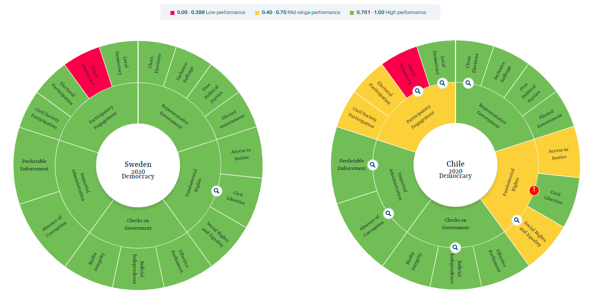
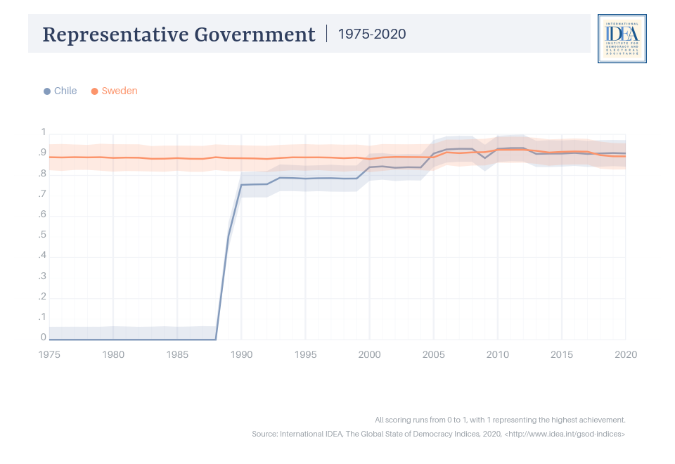
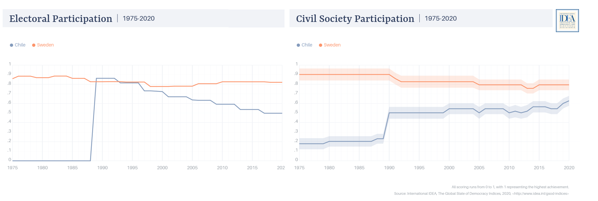
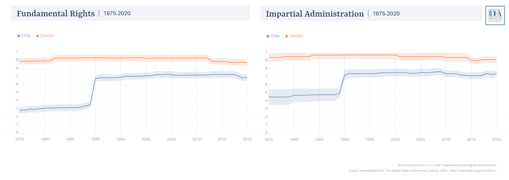

```{r,echo=FALSE}
knitr::opts_chunk$set(out.width="80%", fig.pos = "!ht", out.extra = "", message = F,warning = F,echo=FALSE)
```


<div style="text-align: justify">

# Introducción 


En las últimas décadas se ha levantado la preocupación sobre la apatía política juvenil y la falta de interés en la democracia. Por ello en diversos países se ha relevado la importancia de la educación cívica como una forma de mejorar el compromiso con la democracia. Las alertas sobre las apatía aparecen tanto en democracias completas como en deficientes. Se alerta sobre la falta de confianza en las instituciones, la insatisfacción con la democracia y la desafección respecto a la misma. Frente a esta idea generacional sobre el tema, es necesario preguntarnos ¿hasta qué punto la intensidad de esta apatía política juvenil puede ser teóricamente consistente con el desempeño de la democracia y su influencia en la opinión pública? Defendemos la idea de que la desafección democrática juvenil no es solo un tema generacional, sino que es influido por la opinión pública sobre la democracia, la cual a su vez depende de la calidad de la democracia. Visto desde este punto de vista, para tener ciudadanos comprometidos con la democracia, no bastaría con enseñar ciudadanía, sino que sería necesario contar con una buena democracia. 

Para profundizar en la relación teórica entre la desafección democrática juvenil y la calidad de la democracia se analizan dos países que son sistemas democráticos, aunque con diferencias relevantes, Suecia y Chile (Índice de la Democracia, 2019). En una primera instancia se describirán y compararán ambos sistemas democráticos, dando cuenta de sus diferencias en torno al sistema democrático, utilizando el índice de la democracia (DI). En segundo lugar, se evaluará las diferencias de ambos países en torno a la opinión publica sobre la democracia y las prácticas democráticas, utilizando para ello la encuesta mundial de valores (WVS). En un tercer apartado, se profundizará en las diferencias de jóvenes Chilenos y Suecos sobre su valoración de la democracia, utilizando dos muestras independientes. Finalmente, en un cuarto apartado, se prueba esta hipótesis utilizando los datos de la encuesta Internacional de educación cívica y ciudadana (ICCS), la WVS y el DI. La comparación entre ambos países permite observar diferencias en aspectos fundamentales de la democracia y una consecuente actitud negativa frente a la democracia, a la vez que se encontró __COMPLETAR CON LOS RESULTADOS.__


# Suecia y Chile: Comparación entre una duradera democracia plena y una democracia con desempeño medio. 
Durante los últimos 30 años tanto Chile como Suecia han sido considerados como sistemas democráticos. No obstante, existen considerables diferencias en la garantía efectiva de la democracia de ambos países, entre las cuales destacan diferencias sobre los derechos fundamentales y el compromiso con la participación. Antes de indagar en dichas diferencias y en su cambio histórico, es necesario señalar las diferencias de los sistemas democráticos chileno y sueco. 


## Parlamentarismo, presidencialismo y consecuencias del sistema politico

Ambos países cuentan con distintos sistemas democráticos, mientras Suecia es una democracia parlamentaria, Chile es una república democrática presidencialista. Como señalan sus sitios oficiales, Chile posee “sistema político republicano, democrático y representativo, con un gobierno de carácter presidencial”. El presidente, que encabeza el poder ejecutivo, es elegido por sufragio popular y directo por todos los ciudadanos chilenos mayores de 18 años, por períodos de 4 años [Chile.cl](https://chile.gob.cl/chile/sistema-politico). Por su parte, Suecia, según señalan sus páginas oficiales, “es una democracia parlamentaria, lo que significa que todo el poder público procede del pueblo. A nivel nacional, el pueblo está representado por el parlamento sueco que tiene poder legislativo. El Gobierno implementa las decisiones del parlamento y elabora propuestas para nuevas leyes o enmiendas de leyes.” [Suecia.se](https://www.government.se/how-sweden-is-governed/).

La relación entre el poder legislativo y ejecutivo difiere en ambos sistemas democráticos, lo cual posee implicancias para distintas áreas de la política (). Mientras que en Chile el gobierno es quien lidera las propuestas, en Suecia es el parlamento quien lo hace. Además, mientras que en Chile el gobierno es electo directamente, en Suecia es el parlamento quien elige el gobierno. Estas diferencias propias de los sistemas parlamentarios y presidenciales afectan distintos ámbitos como del desarrollo político. Al respecto, (Gerring, 2009)[10.1177/0010414008325573] señala que los parlamentarismos son más idóneos para el desarrollo politico, económico y del bienestar humano. Pese a que existen autores que no han encontrado un efecto sólido del presidencialismo o el parlamentarismo sobre el crecimiento (Knutsen, 2011)[ 10.1016/j.electstud.2010.09.006], sin embargo, si se ha señalado que la fórmula presidencialista es inherentemente menos capaz que el parlamentarismo para respaldar el grado de representatividad y legitimidad requerido como base mínima para la supervivencia de la gobernabilidad democrática [Riggs,1997](10.1177/019251297018003003). 

En suma, se puede decir que Suecia respecto a Chile posee un sistema político óptimo para el desarrollo político,  fomentar la representación y la legitimidad democrática. En función de lo anterior resultan relevantes dos preguntas ¿Logra efectivamente Suecia un mejor desarrollo de su sistema democrático? Y consecuentemente ¿Posee Suecia una mayor legitimidad de la democracia en la opinión pública? 

## Comparación democratica entre Chile y Suecia 

Para una primera aproximación general a la diferencia de la calidad de la democracia entre Chile y Suecia, utilizaremos el Indice de la democracia, más específicamente, la tipología por dimensión.  En ella se clasifica el desempeño en cada dimensión y subdimensión de la democracia. Las cinco dimensiones consideradas por el índice de la democracia son: la existencia de un gobierno representativo, de derechos fundamentales, de fiscalización del gobierno, una administración imparcial y el involucramiento en la participación política.

Mientras que Suecia posee un desempeño adecuado en cada una de las cinco dimensiones del índice de la democracia, Chile posee un desempeño adecuado en tres y un desempeño mediocre en dos áreas. La primera de estas áreas es la garantía de derechos fundamentales, siendo Chile deficitario en otorgar acceso a la justicia y derechos sociales. La segunda de estas áreas es el compromiso con la participación política, en donde solo una dimensión es adecuada, la democracia local.




Respecto a la garantía de derechos fundamentales, Chile ha presentado problemas sobre la Integridad Personal y Seguridad, pues existen casos de uso excesivo de la fuerza por agentes del estado, de hecho, la “Justicia chilena procesó a nueve militares por delitos de tortura contra un grupo de jóvenes” . Además,  “Desde octubre de 2019, cuando comenzaron las protestas que dejaron unas 30 personas muertas y miles de heridos y detenidos, se han abierto más de 4.600 casos contra agentes policiales o militares”. En línea con estas faltas al debido proceso, se han registrado casos de detenciones arbitrarias (DI, 2021).

Respecto al compromiso con la participación, Chile, a diferencia de Suecia presenta un desempeño no optimo en dos dimensiones, en la participación electoral y en la participación civil. La participación electoral chilena difícilmente supera el 50% en las elecciones, lo cual ocurre desde la eliminación del voto obligatorio en el 2013. Por su parte Suecia logra alrededor de un 87% de participación [IDEA] (https://www.idea.int/data-tools/country-view/261/40).
En suma, aunque ambos países tienen gobiernos representativos, la democracia de Suecia destaca en la garantía de derechos sociales y de acceso a la justicia, así como también destaca en el involucramiento político. 


## Comparación historica de la calidad de la democracia 

En esta sección se describirá el desempeño de la democracia chilena y sueca en distintos ámbitos a lo largo del tiempo.  Los gráficos solo incluyen información desde 1975 hasta el 2020. Los gráficos provienen directamente de la plataforma virtual de visualización de datos de el Índice de la Democracia [(IDEA, 2022)](https://www.idea.int/gsod-indices/compare-countries-regions). 

En el primer grafico se puede apreciar el desempeño de Chile y Suecia en una dimensión elemental de la democracia, la elección democrática del gobierno. Como se puede apreciar, aunque ambos países cuentan actualmente con niveles adecuados de la representatividad del gobierno, estos tienen historias y trayectorias distintas.

Las diferentes trayectorias de la democracia en ambos países poseen un efecto en la vida ciudadana. Mientras Suecia ha sido una democracia estable durante los últimos 50 años, Chile es una democracia desde 1990, pues desde 1973 hasta dicha fecha tuvo un gobierno dictatorial. Esto posee como consecuencia que varías cortes crecieron y vivieron su ciudadanía en un contexto donde la política y los partidos estaban prohibidos y eran perseguidos. Esto tiene como implicancia que varías generaciones, que incluso nacieron en democracia, se crían con padres que tuvieron una relación lejana con la democracia. [Buscar cita de efecto cohorte autoritarismo].

 


Los años de ausencia de la democracia se hacen presentes en las prácticas democráticas de los ciudadanos Chilenos. Suecia posee una alta participación, que es tan estable como lo ha sido su democracia. Por su parte, en Chile se puede observar un gran aumento de la participación al finalizar la democracia en 1990, no obstante, mientras avanza el periodo democrático se observa un descenso en esa participación.  Respecto a la participación de los ciudadanos en organizaciones de la sociedad civil se destaca que Suecia posee una mayor participación que Chile, aunque este el de este ultimo ha crecido ligeramente en estos años, además del gran repunte posterior al fin de la dictadura Chilena. Por su parte, Suecia desciende ligeramente en este ámbito. 




Junto con esta falta de participación de Chile, se puede observar un mejor cumplimiento de objetivos democráticos como la garantía de los derechos fundamentales y la administración imparcial por parte de Suecia respecto a Chile. En ambos ámbitos se puede observar que Suecia ha tenido un alto y estable desempeño, mientras que Chile tuvo en el periodo dictatorial un bajo desempeño. Algunos autores han señalado que la falta de garantía en los derechos de distintos países fomenta distintas visiones de lo que es un buen ciudadano, de modo tal que en aquellas democracias con mejor garantía de derechos fomentan visiones de ciudadanos más centradas en el la norma democrática que en la crítica. En una línea similar, y en relación con la imparcialidad de la administración, se ha señalado que las sensaciones de injusticias (que pueden ser producidas por tratos diferenciados) pueden fomentar actitudes de insubordinación.



