```{r include=FALSE, echo=FALSE}

knitr::opts_chunk$set(
  include=FALSE,
	error = TRUE,
	message = FALSE,
	warning = FALSE
)
pacman::p_load(ggplot2, ggtext, descr, haven,dplyr,ggrepel)

load(file = "input/data/proc/data_paces.Rdata")
load(file = "input/data/proc/data_psp.Rdata")
```

# Comparación de la vivencia democratica juvenil

El presente apartado compara las experiencias con la ciudadanía de los jóvenes de Chile y Suecia. Para ello, se contrastan las opiniones, valores y practicas relativas a la democracia de ambos países en población estudiantil con las mismas edades. Sobre la opinión respecto a su democracia, se describirá el nivel de satisfacción con la democracia de los jóvenes de ambos países, así como sobre su confianza en las instituciones democráticas. Para comparar los valores democráticos, se revisará sus concepciones de un buen ciudadano y sus opiniones sobre la igualdad de derechos. Finalmente se contrasta la participación democrática en la esfera pública, en la escuela y con sus cercanos. 

Para enriquecer la comparación, se hará referencia constante a los elementos del contexto de cada país revisados anteriormente. El contraste de la experiencia democrática juvenil de ambos países se hará destacando la calidad de la democracia de ambos países. Al reflexionar sobre las diferencias y similitudes de la experiencia de los jóvenes se tomara en cuenta la calidad de las instituciones democráticas y tanto la participación como la opinión sobre la democracia en la población adulta de ambos países. 

## Opinion sobre su democracia

El siguiente grafico expone la satisfacción con la democracia de los jóvenes de ambos países. En ambos casos se le pregunta respecto a su satisfacción con la democracia de su propio país. La cantidad de categorías de respuesta era la misma en ambas encuestas y los mensajes son bastante similares, aunque solo las categorías extremas son equivalentes.

La satisfacción con la democracia de los jóvenes de ambos países difiere radicalmente, de modo tal que es mucho mayor en Suecia que en Chile. La cantidad de estudiantes nada satisfechos es de 28,2% en Chile y de 2,7% en Suecia. Proporcionalmente hablando, por cada estudiante insatisfecho con la democracia en Suecia hay 10 estudiantes insatisfechos con su democracia en Chile. 


```{r}
## paces
data_paces_sat=data_paces %>% select(P15) %>% as.data.frame
data_paces_sat <- na.omit(data_paces_sat)
data_paces_sat$P15 <- factor(data_paces_sat$P15, levels = c(1,2,3,4), labels = c("
  <br>
  <strong>
  Nada satisfecho</strong></b>
  <br>", "
  <br> 
  <strong>
  Algo satisfecho</strong></b>
  <br>", "
  <br>
  <strong>
  Satisfecho</strong></b>
  <br>", "
  <br>
  <strong>
  Muy satisfecho</strong></b>
  <br>"))
sat <- data_paces_sat %>%
  group_by("Alternativas"=P15) %>%
  summarise(counts = n())
f_sat<-freq(data_paces_sat$P15)
sat$prop<-f_sat[1:4,2]
sat <- sat %>%
  arrange(desc(Alternativas)) %>%
  mutate(
         lab.ypos = cumsum(prop) - 0.5*prop)
plot_sat <- ggplot(sat, aes(x = 2, y = prop, fill = Alternativas)) +
  geom_bar(stat = "identity", color = "white") +
  coord_polar(theta = "y", start = 1.5)+
  geom_text(aes(label = format(paste(round(prop,1),"%")), y = lab.ypos), color = "black", size=6) +
  scale_fill_brewer(palette = "Purples") +
  theme_void()+
  xlim(0.5, 2.5) +
  theme(legend.title = element_text(size=16, face="bold")) +
  theme(legend.text = element_markdown(colour = "grey20", size =14)) +
  ggtitle("<strong><span style='font-size:28px'>On the whole, how satisfied are you with the way democracy works in ´country´?</span></strong><br>",subtitle = "<strong><span style='font-size:23px'>PACES</span></strong>") +  
  theme(plot.title = element_markdown(hjust=-0.05),
       ##legend.direction = "horizontal",
       ##legend.position = "bottom",
##       legend.position=c(1,0),
##              legend.position = c(.95, .95),
    legend.justification = c("left"),##, "top"),
    legend.box.just = "left",
    legend.margin = margin(6, 6, 6, 6),
    plot.subtitle = element_markdown(hjust = 0.5),
       legend.title = element_blank())

## psp
data_psp_sat=data_psp %>% select(sat1) %>% as.data.frame
data_psp_sat <- na.omit(data_psp_sat)
##data_psp_sat$sat1 <- factor(data_psp_sat$sat1, levels = c(4,3,2,1), labels = c("
data_psp_sat$sat1 <- factor(data_psp_sat$sat1, levels = c(1,2,3,4), labels = c("
  <br>
  <strong>
  Not satisfied at all</strong></b>
  <br>", "
  <br> 
  <strong>
  Not especially <br>satisfied(a)</strong></b>
  <br>", "
  <br>
  <strong>
  Quite satisfied(a)</strong></b>
  <br>", "
  <br>
  <strong>
  Very satisfied(a)</strong></b>
  <br>"))
sat <- data_psp_sat %>%
  group_by("Alternativas"=sat1) %>%
  summarise(counts = n())
f_sat<-freq(data_psp_sat$sat1)
sat$prop<-f_sat[1:4,2]
sat <- sat %>%
  arrange(desc(Alternativas)) %>%
  mutate(
         lab.ypos = cumsum(prop) - 0.5*prop)
plot_sat_psp <- ggplot(sat, aes(x = 2, y = prop, fill = Alternativas)) +
  geom_bar(stat = "identity", color = "white") +
  coord_polar(theta = "y", start = 1.5)+
  geom_text(aes(label = format(paste(round(prop,1),"%")), y = lab.ypos), color = "black", size=6) +
  scale_fill_brewer(palette = "Purples") +##, 
                    ##guide = guide_legend(reverse = TRUE)) +##,
                    ##direction=-1) +
  theme_void()+
  xlim(0.5, 2.5) +
  theme(legend.title = element_text(size=16, face="bold")) +
  theme(legend.text = element_markdown(colour = "grey20", size =14)) +
  ggtitle(" ",subtitle="<br><br><strong><span style='font-size:23px'>PSP</span></strong>") +  
  theme(##legend.direction = "horizontal",
       ##legend.position = "bottom",
##       legend.position=c(1,0),
##           legend.position = c(.95, .95),,
    legend.justification = c("left"),##, "top"),
    legend.box.just = "left",
    legend.margin = margin(6, 6, 6, 6),
    plot.subtitle = element_markdown(hjust = 0.5),
       legend.title = element_blank())

## Gráfico conjunto
plotsat <- cowplot::plot_grid(plot_sat,plot_sat_psp, ncol=2)
ggsave(plotsat, file = "output/graph_sat.png",device = "png",width = 30,height = 20,dpi = "retina",units = "cm")

#
```

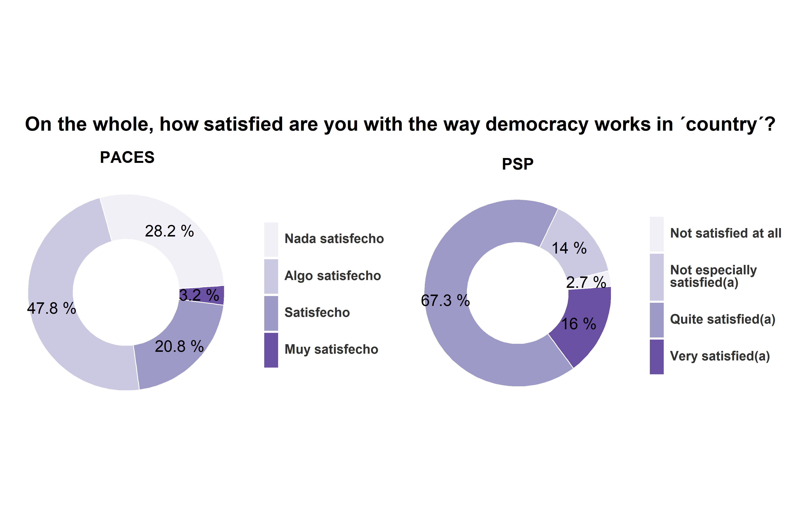

El que los jóvenes suecos estén más satisfechos con su democracia que los jóvenes chilenos es relativamente consistente con la calidad actual de las democracias en ambos países. Aunque según el índice de la democracia actualmente tanto en Chile como en Suecia existe una administración imparcial, controles gubernamentales y un gobierno representativo, existen diferencias sustanciales en otros aspectos. Contrario al caso Sueco, en Chile no existe una garantía real de los derechos fundamentales, ni tampoco existe un adecuado compromiso con la participación. En el caso Chileno es especialmente deficitario el acceso a la justicia y a los derechos sociales. Es razonable considerar que la ausencia de condiciones adecuadas para el desarrollo de una adecuada vida ciudadana merma la satisfacción con la democracia en el caso chileno, lo cual es consistente con la evidencia que destaca la falta de valoración de la democracia ante la falta de derechos sociales adecuados ().


#### Confianza en sus instituciones democraticas

El grafico venidero compara la confianza que poseen los estudiantes de los partidos políticos de sus países. Ambas preguntas tienen cuatro categorías, pero las alternativas no son equivalentes. 


En ambos países existen distintos niveles de confianza en los partidos, destacando la mayor confianza que tienen los jóvenes suecos. En Suecia, más de la mitad de los jóvenes confía bastante o mucho en los partidos, mientras que en Chile esto ocurre solo con el 15% de los jóvenes. Consecuentemente existe una gran cantidad de jóvenes chilenos con nada de confianza en los partidos, proporcionalmente hablando, por cada estudiante sueco que no confía en los partidos, en chile hay 6 jóvenes que no lo hacen.

Esto es un problema para chile ya que difícilmente se puede confiar en la democracia y las instituciones democrática, si no se confía en sus principales actores, los partidos. 
[Consecuencia de la baja confianza en partidos]


__Political parties__

```{r}

# paces
data_paces_sat=data_paces %>% select(P22C) %>% as.data.frame
data_paces_sat <- na.omit(data_paces_sat)
data_paces_sat$P22C <- factor(data_paces_sat$P22C, levels = c(1,2,3,4), labels = c("
  <br>
  <strong>
  Nada </strong></b>
  <br>", "
  <br> 
  <strong>
  Poco </strong></b>
  <br>", "
  <br>
  <strong>
  Bastante </strong></b>
  <br>", "
  <br>
  <strong>
  Completamente </strong></b>
  <br>"))
sat <- data_paces_sat %>%
  group_by("Alternativas"=P22C) %>%
  summarise(counts = n())
f_sat<-freq(data_paces_sat$P22C)
sat$prop<-f_sat[1:4,2]
sat <- sat %>%
  arrange(desc(Alternativas)) %>%
  mutate(
         lab.ypos = cumsum(prop) - 0.5*prop)
plot_sat <- ggplot(sat, aes(x = 2, y = prop, fill = Alternativas)) +
  geom_bar(stat = "identity", color = "white") +
  coord_polar(theta = "y", start = 1.5)+
  geom_text(aes(label = format(paste(round(prop,1),"%")), y = lab.ypos), color = "black", size=6) +
  scale_fill_brewer(palette = "Purples") +
  theme_void()+
  xlim(0.5, 2.5) +
  theme(legend.title = element_text(size=16, face="bold")) +
  theme(legend.text = element_markdown(colour = "grey20", size =14)) +
  ggtitle("<strong><span style='font-size:28px'> Political parties </strong> </span>", subtitle = "<strong><span style='font-size:23px'>PACES</span></strong>") +  
  theme(plot.title = element_markdown(hjust=3),
       #legend.direction = "horizontal",
       #legend.position = "bottom",
#       legend.position=c(1,0),
#              legend.position = c(.95, .95),
    legend.justification = c("left"),#, "top"),
    legend.box.just = "left",
    legend.margin = margin(6, 6, 6, 6),
    plot.subtitle = element_markdown(hjust = 0.5),
       legend.title = element_blank())


#######################################################
# psp
#######################################################

#PRE6

data_psp_sat=data_psp %>% select(tfr5) %>% as.data.frame
data_psp_sat <- na.omit(data_psp_sat)
#data_psp_sat$tfr5 <- factor(data_psp_sat$tfr5, levels = c(4,3,2,1), labels = c("
data_psp_sat$tfr5 <- factor(data_psp_sat$tfr5, levels = c(4,3,2,1), labels = c("
  <br>
  <strong>
  No trust at all  </strong></b>
  <br>", "
  <br> 
  <strong>
  Not a lot of trust <br> </strong></b>
  <br>", "
  <br>
  <strong>
  Quite a lot of trust </strong></b>
  <br>", "
  <br>
  <strong>
  A lot of trust </strong></b>
  <br>"))
  sat <- data_psp_sat %>%
  group_by("Alternativas"=tfr5) %>%
  summarise(counts = n())
f_sat<-freq(data_psp_sat$tfr5)
sat$prop<-f_sat[1:4,2]
sat <- sat %>%
  arrange(desc(Alternativas)) %>%
  mutate(
         lab.ypos = cumsum(prop) - 0.5*prop)
plot_sat_psp <- ggplot(sat, aes(x = 2, y = prop, fill = Alternativas)) +
  geom_bar(stat = "identity", color = "white") +
  coord_polar(theta = "y", start = 1.5)+
  geom_text(aes(label = format(paste(round(prop,1),"%")), y = lab.ypos), color = "black", size=6) +
  scale_fill_brewer(palette = "Purples") +#, 
                    #guide = guide_legend(reverse = TRUE)) +#,
                    #direction=-1) +
  theme_void()+
  xlim(0.5, 2.5) +
  theme(legend.title = element_text(size=16, face="bold")) +
  theme(legend.text = element_markdown(colour = "grey20", size =14)) +
  ggtitle("<b>",subtitle = "<strong><span style='font-size:23px'>PSP</span></strong>") +
  theme(plot.title = element_markdown(hjust=0.0),
       #legend.direction = "horizontal",
       #legend.position = "bottom",
#       legend.position=c(1,0),
#              legend.position = c(.95, .95),
    legend.justification = c("left"),#, "top"),
    legend.box.just = "left",
    legend.margin = margin(6, 6, 6, 6),
    plot.subtitle = element_markdown(hjust = 0.5),
       legend.title = element_blank())

# Gráfico conjunto
plotru4<- cowplot::plot_grid(plot_sat,plot_sat_psp, ncol=2)
  ggsave(plotru4, file = "output/plotru4.png",device = "png",width = 30,height = 20,dpi = "retina",units = "cm")

```
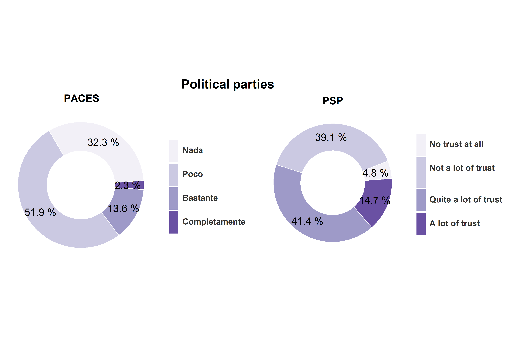


__### Trust in people__


```{r}

# paces
data_paces_sat=data_paces %>% select(P22F) %>% as.data.frame
data_paces_sat <- na.omit(data_paces_sat)
data_paces_sat$P22F <- factor(data_paces_sat$P22F, levels = c(1,2,3,4), labels = c("
  <br>
  <strong>
  Nada </strong></b>
  <br>", "
  <br> 
  <strong>
  Poco </strong></b>
  <br>", "
  <br>
  <strong>
  Bastante </strong></b>
  <br>", "
  <br>
  <strong>
  Completamente </strong></b>
  <br>"))
sat <- data_paces_sat %>%
  group_by("Alternativas"=P22F) %>%
  summarise(counts = n())
f_sat<-freq(data_paces_sat$P22F)
sat$prop<-f_sat[1:4,2]
sat <- sat %>%
  arrange(desc(Alternativas)) %>%
  mutate(
         lab.ypos = cumsum(prop) - 0.5*prop)
plot_sat <- ggplot(sat, aes(x = 2, y = prop, fill = Alternativas)) +
  geom_bar(stat = "identity", color = "white") +
  coord_polar(theta = "y", start = 1.5)+
  geom_text(aes(label = format(paste(round(prop,1),"%")), y = lab.ypos), color = "black", size=6) +
  scale_fill_brewer(palette = "Purples") +
  theme_void()+
  xlim(0.5, 2.5) +
  theme(legend.title = element_text(size=16, face="bold")) +
  theme(legend.text = element_markdown(colour = "grey20", size =14)) +
  ggtitle("<strong><span style='font-size:28px'> Most people can be trusted </strong> </span>", subtitle = "<strong><span style='font-size:23px'>PACES</span></strong>") +  
  theme(plot.title = element_markdown(hjust=-15),
       #legend.direction = "horizontal",
       #legend.position = "bottom",
#       legend.position=c(1,0),
#              legend.position = c(.95, .95),
    legend.justification = c("left"),#, "top"),
    legend.box.just = "left",
    legend.margin = margin(6, 6, 6, 6),
    plot.subtitle = element_markdown(hjust = 0.5),
       legend.title = element_blank())


#######################################################
# psp
#######################################################

#PRE6

data_psp_sat=data_psp %>% select(ma1) %>% as.data.frame
data_psp_sat <- na.omit(data_psp_sat)
#data_psp_sat$ma1 <- factor(data_psp_sat$ma1, levels = c(4,3,2,1), labels = c("
data_psp_sat$ma1 <- factor(data_psp_sat$ma1, levels = c(1,2,3,4,5), labels = c("
  <br>
  <strong>
  Doesn’t apply at all </strong></b>
  <br>", "
  <br> 
  <strong>
  Doesn’t apply so well <br> </strong></b>
  <br>", 
  
  "
  <br>
  <strong>
  Kind of applies </strong></b>
  <br>"
  ,
  "
  <br>
  <strong>
  Applies quite well </strong></b>
  <br>", "
  <br>
  <strong>
  Applies perfectly </strong></b>
  <br>"))
  sat <- data_psp_sat %>%
  group_by("Alternativas"=ma1) %>%
  summarise(counts = n())
f_sat<-freq(data_psp_sat$ma1)
sat$prop<-f_sat[1:5,2]
sat <- sat %>%
  arrange(desc(Alternativas)) %>%
  mutate(
         lab.ypos = cumsum(prop) - 0.5*prop)
plot_sat_psp <- ggplot(sat, aes(x = 2, y = prop, fill = Alternativas)) +
  geom_bar(stat = "identity", color = "white") +
  coord_polar(theta = "y", start = 1.5)+
  geom_text(aes(label = format(paste(round(prop,1),"%")), y = lab.ypos), color = "black", size=6) +
  scale_fill_brewer(palette = "Purples") +#, 
                    #guide = guide_legend(reverse = TRUE)) +#,
                    #direction=-1) +
  theme_void()+
  xlim(0.5, 2.5) +
  theme(legend.title = element_text(size=16, face="bold")) +
  theme(legend.text = element_markdown(colour = "grey20", size =14)) +
  ggtitle("<b>",subtitle = "<strong><span style='font-size:23px'>PSP</span></strong>") +
  theme(plot.title = element_markdown(hjust=0.0),
       #legend.direction = "horizontal",
       #legend.position = "bottom",
#       legend.position=c(1,0),
#              legend.position = c(.95, .95),
    legend.justification = c("left"),#, "top"),
    legend.box.just = "left",
    legend.margin = margin(6, 6, 6, 6),
    plot.subtitle = element_markdown(hjust = 0.5),
       legend.title = element_blank())

# Gráfico conjunto
plotru6<- cowplot::plot_grid(plot_sat,plot_sat_psp, ncol=2)
ggsave(plotru6, file = "output/plotru5.png",device = "png",width = 30,height = 20,dpi = "retina",units = "cm")

```
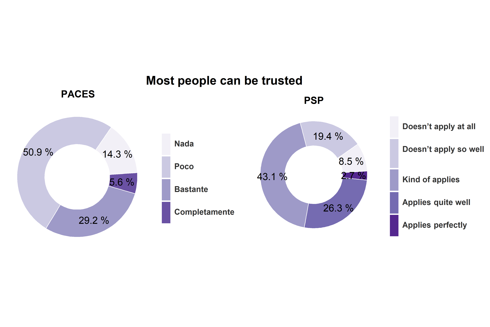


```{r}
# parlamento


# paces
data_paces_sat=data_paces %>% select(P22D) %>% as.data.frame
data_paces_sat <- na.omit(data_paces_sat)
data_paces_sat$P22D <- factor(data_paces_sat$P22D, levels = c(1,2,3,4), labels = c("
  <br>
  <strong>
  Nada </strong></b>
  <br>", "
  <br> 
  <strong>
  Poco </strong></b>
  <br>", "
  <br>
  <strong>
  Bastante </strong></b>
  <br>", "
  <br>
  <strong>
  Completamente </strong></b>
  <br>"))
sat <- data_paces_sat %>%
  group_by("Alternativas"=P22D) %>%
  summarise(counts = n())
f_sat<-freq(data_paces_sat$P22D)
sat$prop<-f_sat[1:4,2]
sat <- sat %>%
  arrange(desc(Alternativas)) %>%
  mutate(
         lab.ypos = cumsum(prop) - 0.5*prop)
plot_sat <- ggplot(sat, aes(x = 2, y = prop, fill = Alternativas)) +
  geom_bar(stat = "identity", color = "white") +
  coord_polar(theta = "y", start = 1.5)+
  geom_text(aes(label = format(paste(round(prop,1),"%")), y = lab.ypos), color = "black", size=6) +
  scale_fill_brewer(palette = "Purples") +
  theme_void()+
  xlim(0.5, 2.5) +
  theme(legend.title = element_text(size=16, face="bold")) +
  theme(legend.text = element_markdown(colour = "grey20", size =14)) +
  ggtitle("<strong><span style='font-size:28px'> The parliament </strong> </span>", subtitle = "<strong><span style='font-size:23px'>PACES</span></strong>") +  
  theme(plot.title = element_markdown(hjust=3),
       #legend.direction = "horizontal",
       #legend.position = "bottom",
#       legend.position=c(1,0),
#              legend.position = c(.95, .95),
    legend.justification = c("left"),#, "top"),
    legend.box.just = "left",
    legend.margin = margin(6, 6, 6, 6),
    plot.subtitle = element_markdown(hjust = 0.5),
       legend.title = element_blank())


#######################################################
# psp
#######################################################

#PRE6

data_psp_sat=data_psp %>% select(tfr1) %>% as.data.frame
data_psp_sat <- na.omit(data_psp_sat)
#data_psp_sat$tfr1 <- factor(data_psp_sat$tfr1, levels = c(4,3,2,1), labels = c("
data_psp_sat$tfr1 <- factor(data_psp_sat$tfr1, levels = c(4,3,2,1), labels = c("
  <br>
  <strong>
  No trust at all  </strong></b>
  <br>", "
  <br> 
  <strong>
  Not a lot of trust <br> </strong></b>
  <br>", "
  <br>
  <strong>
  Quite a lot of trust </strong></b>
  <br>", "
  <br>
  <strong>
  A lot of trust </strong></b>
  <br>"))
  sat <- data_psp_sat %>%
  group_by("Alternativas"=tfr1) %>%
  summarise(counts = n())
f_sat<-freq(data_psp_sat$tfr1)
sat$prop<-f_sat[1:4,2]
sat <- sat %>%
  arrange(desc(Alternativas)) %>%
  mutate(
         lab.ypos = cumsum(prop) - 0.5*prop)
plot_sat_psp <- ggplot(sat, aes(x = 2, y = prop, fill = Alternativas)) +
  geom_bar(stat = "identity", color = "white") +
  coord_polar(theta = "y", start = 1.5)+
  geom_text(aes(label = format(paste(round(prop,1),"%")), y = lab.ypos), color = "black", size=6) +
  scale_fill_brewer(palette = "Purples") +#, 
                    #guide = guide_legend(reverse = TRUE)) +#,
                    #direction=-1) +
  theme_void()+
  xlim(0.5, 2.5) +
  theme(legend.title = element_text(size=16, face="bold")) +
  theme(legend.text = element_markdown(colour = "grey20", size =14)) +
  ggtitle(" ",subtitle = "<strong><span style='font-size:23px'>PSP</span></strong>") +
  theme(plot.title = element_markdown(hjust=0.0),
       #legend.direction = "horizontal",
       #legend.position = "bottom",
#       legend.position=c(1,0),
#              legend.position = c(.95, .95),
    legend.justification = c("left"),#, "top"),
    legend.box.just = "left",
    legend.margin = margin(6, 6, 6, 6),
    plot.subtitle = element_markdown(hjust = 0.5),
       legend.title = element_blank())

# Gráfico conjunto
plotru2<- cowplot::plot_grid(plot_sat,plot_sat_psp, ncol=2)
ggsave(plotru2, file = "output/plotru2.png",device = "png",width = 30,height = 20,dpi = "retina",units = "cm")

```
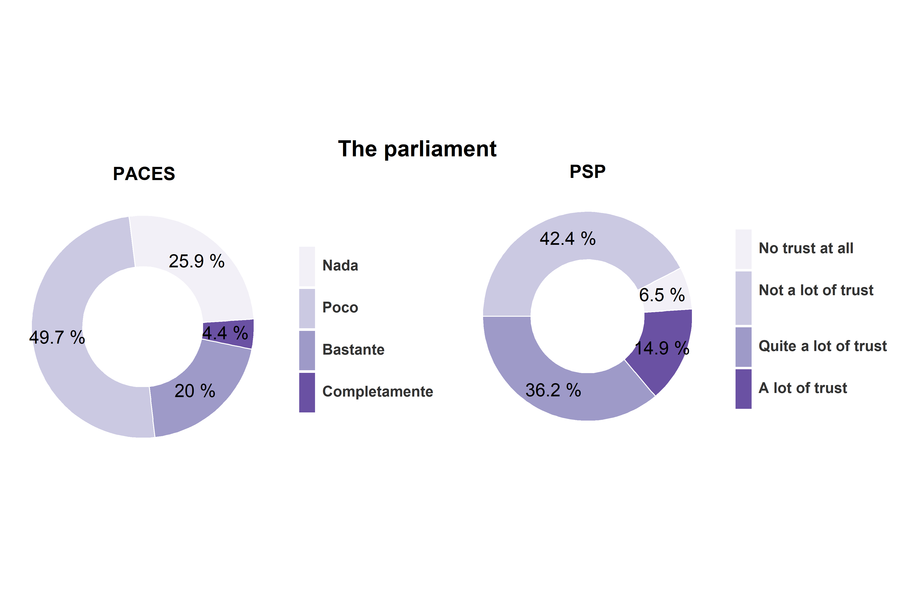

[Comparar con la aceptación de los partidos en adultos]


__Goverment__ 

Los siguientes gráficos exponen el nivel de confianza de los jóvenes suecos y chilenos sobre el gobierno y el parlamento.  Pese a las diferencias, se puede observar que la confianza no sobrepasa el 60% en ninguno de los países, existiendo en ambos amplios grupos de jóvenes con baja confianza en las instituciones democráticas.  Aun así, el nivel de confianza en ambas instituciones es distinto en ambos países, existe una mayor confianza en Suecia que en Chile. 

Comparando la confianza en estas dos instituciones democráticas con la confianza en los partidos, que son actores relevantes en ambos poderes, se puede observar otra diferencia entre estos países. En Suecia la mitad de los jóvenes confía tanto en los partidos como en las instituciones democráticas, con un porcentaje similar de confianza sobre los partidos, el gobierno y el parlamento. Por su parte,  en chile se observa una diferencia en la confianza en estas instituciones, existiendo una mayor confianza en los poderes del estado, que en los partidos que los administran.  


```{r}

# paces
data_paces_sat=data_paces %>% select(P22A) %>% as.data.frame
data_paces_sat <- na.omit(data_paces_sat)
data_paces_sat$P22A <- factor(data_paces_sat$P22A, levels = c(1,2,3,4), labels = c("
  <br>
  <strong>
  Nada </strong></b>
  <br>", "
  <br> 
  <strong>
  Poco </strong></b>
  <br>", "
  <br>
  <strong>
  Bastante </strong></b>
  <br>", "
  <br>
  <strong>
  Completamente </strong></b>
  <br>"))
sat <- data_paces_sat %>%
  group_by("Alternativas"=P22A) %>%
  summarise(counts = n())
f_sat<-freq(data_paces_sat$P22A)
sat$prop<-f_sat[1:4,2]
sat <- sat %>%
  arrange(desc(Alternativas)) %>%
  mutate(
         lab.ypos = cumsum(prop) - 0.5*prop)
plot_sat <- ggplot(sat, aes(x = 2, y = prop, fill = Alternativas)) +
  geom_bar(stat = "identity", color = "white") +
  coord_polar(theta = "y", start = 1.5)+
  geom_text(aes(label = format(paste(round(prop,1),"%")), y = lab.ypos), color = "black", size=6) +
  scale_fill_brewer(palette = "Purples") +
  theme_void()+
  xlim(0.5, 2.5) +
  theme(legend.title = element_text(size=16, face="bold")) +
  theme(legend.text = element_markdown(colour = "grey20", size =14)) +
  ggtitle("<strong><span style='font-size:28px'> The government </strong> </span>", subtitle = "<strong><span style='font-size:23px'>PACES</span></strong>") +  
  theme(plot.title = element_markdown(hjust=3),
       #legend.direction = "horizontal",
       #legend.position = "bottom",
#       legend.position=c(1,0),
#              legend.position = c(.95, .95),
    legend.justification = c("left"),#, "top"),
    legend.box.just = "left",
    legend.margin = margin(6, 6, 6, 6),
    plot.subtitle = element_markdown(hjust = 0.5),
       legend.title = element_blank())


#######################################################
# psp
#######################################################

#PRE6

data_psp_sat=data_psp %>% select(tfr2) %>% as.data.frame
data_psp_sat <- na.omit(data_psp_sat)
#data_psp_sat$tfr2 <- factor(data_psp_sat$tfr2, levels = c(4,3,2,1), labels = c("
data_psp_sat$tfr2 <- factor(data_psp_sat$tfr2, levels = c(4,3,2,1), labels = c("
  <br>
  <strong>
  No trust at all  </strong></b>
  <br>", "
  <br> 
  <strong>
  Not a lot of trust <br> </strong></b>
  <br>", "
  <br>
  <strong>
  Quite a lot of trust </strong></b>
  <br>", "
  <br>
  <strong>
  A lot of trust </strong></b>
  <br>"))
  sat <- data_psp_sat %>%
  group_by("Alternativas"=tfr2) %>%
  summarise(counts = n())
f_sat<-freq(data_psp_sat$tfr2)
sat$prop<-f_sat[1:4,2]
sat <- sat %>%
  arrange(desc(Alternativas)) %>%
  mutate(
         lab.ypos = cumsum(prop) - 0.5*prop)
plot_sat_psp <- ggplot(sat, aes(x = 2, y = prop, fill = Alternativas)) +
  geom_bar(stat = "identity", color = "white") +
  coord_polar(theta = "y", start = 1.5)+
  geom_text(aes(label = format(paste(round(prop,1),"%")), y = lab.ypos), color = "black", size=6) +
  scale_fill_brewer(palette = "Purples") +#, 
                    #guide = guide_legend(reverse = TRUE)) +#,
                    #direction=-1) +
  theme_void()+
  xlim(0.5, 2.5) +
  theme(legend.title = element_text(size=16, face="bold")) +
  theme(legend.text = element_markdown(colour = "grey20", size =14)) +
  ggtitle("<b>",subtitle = "<strong><span style='font-size:23px'>PSP</span></strong>") +
  theme(plot.title = element_markdown(hjust=0.0),
       #legend.direction = "horizontal",
       #legend.position = "bottom",
#       legend.position=c(1,0),
#              legend.position = c(.95, .95),
    legend.justification = c("left"),#, "top"),
    legend.box.just = "left",
    legend.margin = margin(6, 6, 6, 6),
    plot.subtitle = element_markdown(hjust = 0.5),
       legend.title = element_blank())

# Gráfico conjunto
plotru<- cowplot::plot_grid(plot_sat,plot_sat_psp, ncol=2)
ggsave(plotru, file = "output/plotru.png",device = "png",width = 30,height = 20,dpi = "retina",units = "cm")

```
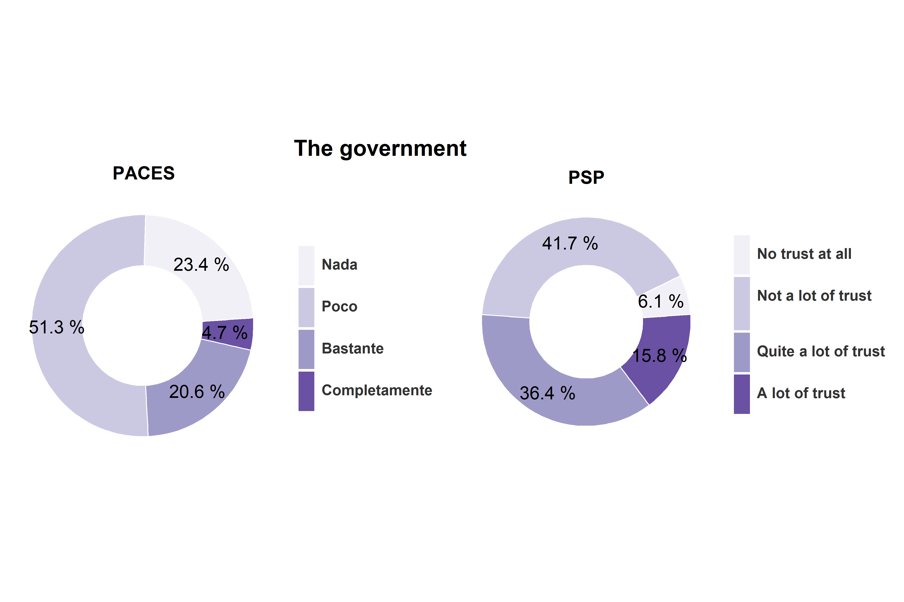


Chile tiene un sistema ejecutivo Suecia tiene un sistema legislativa. Este segundo es un incentivo al acuerdo, mientras que el otro a la competencia (política de la zancadilla de Castells  en texto de red).

__### The courts__


Este grafico expone la confianza en los tribunales, desde el punto de vista de los jóvenes de Chile y Suecia. 
```{r}

# paces
data_paces_sat=data_paces %>% select(P22B) %>% as.data.frame
data_paces_sat <- na.omit(data_paces_sat)
data_paces_sat$P22B <- factor(data_paces_sat$P22B, levels = c(1,2,3,4), labels = c("
  <br>
  <strong>
  Nada </strong></b>
  <br>", "
  <br> 
  <strong>
  Poco </strong></b>
  <br>", "
  <br>
  <strong>
  Bastante </strong></b>
  <br>", "
  <br>
  <strong>
  Completamente </strong></b>
  <br>"))
sat <- data_paces_sat %>%
  group_by("Alternativas"=P22B) %>%
  summarise(counts = n())
f_sat<-freq(data_paces_sat$P22B)
sat$prop<-f_sat[1:4,2]
sat <- sat %>%
  arrange(desc(Alternativas)) %>%
  mutate(
         lab.ypos = cumsum(prop) - 0.5*prop)
plot_sat <- ggplot(sat, aes(x = 2, y = prop, fill = Alternativas)) +
  geom_bar(stat = "identity", color = "white") +
  coord_polar(theta = "y", start = 1.5)+
  geom_text(aes(label = format(paste(round(prop,1),"%")), y = lab.ypos), color = "black", size=6) +
  scale_fill_brewer(palette = "Purples") +
  theme_void()+
  xlim(0.5, 2.5) +
  theme(legend.title = element_text(size=16, face="bold")) +
  theme(legend.text = element_markdown(colour = "grey20", size =14)) +
  ggtitle("<strong><span style='font-size:28px'> The courts </strong> </span>", subtitle = "<strong><span style='font-size:23px'>PACES</span></strong>") +  
  theme(plot.title = element_markdown(hjust=2.5),
       #legend.direction = "horizontal",
       #legend.position = "bottom",
#       legend.position=c(1,0),
#              legend.position = c(.95, .95),
    legend.justification = c("left"),#, "top"),
    legend.box.just = "left",
    legend.margin = margin(6, 6, 6, 6),
    plot.subtitle = element_markdown(hjust = 0.5),
       legend.title = element_blank())


# Gráfico conjunto
plotru3<- cowplot::plot_grid(plot_sat,plot_sat_psp, ncol=2)
ggsave(plotru3, file = "output/plotru3.png",device = "png",width = 30,height = 20,dpi = "retina",units = "cm")


```


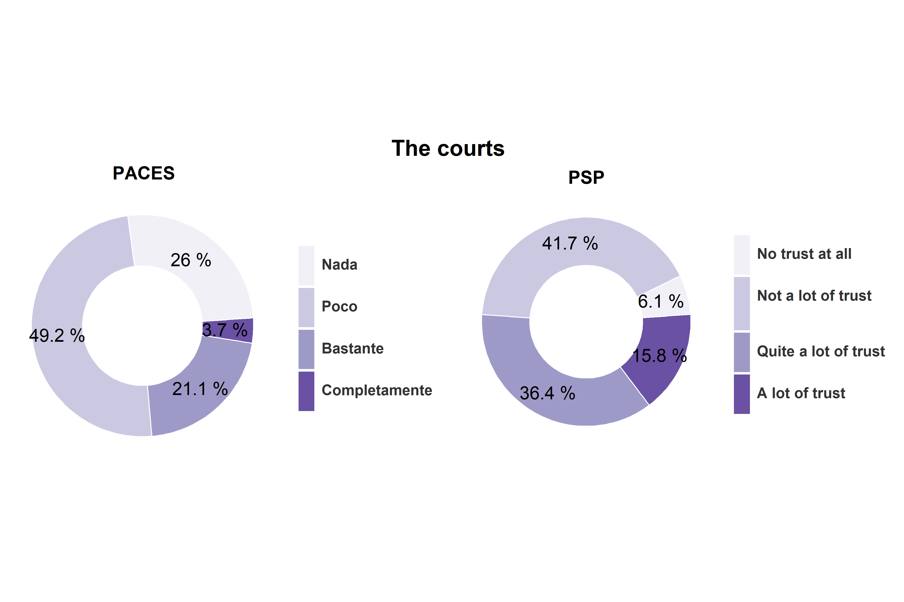

El grafico nos sugiere nuevamente mayor confianza de los jóvenes suecos en su sistema. La proporción de jóvenes que no confía nada en los jueces de chile es un triple de lo que en Suecia. 

Este resultado es consistente con la evaluación del índice de la democracia. Según este, Chile posee un sistema deficiente en torno a la garantía al derecho a la justicia, destacando la desigualdad de los tribunales.  Existen casos emblemáticos que fueron muy mediáticos en chile que generaron la sensación de parcialidad por parte de los jueces []. 


## Valores democraticos


Uno de los valores democráticos es la igualdad de derecho entre las personas. En el caso de Chile, la igualdad de derechos tiene un rol importante en los planes de Educación cívica y formación ciudadana (). La igualdad de derechos implica la no discriminación por razones arbitrarias como sexo u origen. Al respecto los siguientes gráficos nos muestran la opinión de los jóvenes frente a la igualdad de derecho entre géneros y con los inmigrantes.


####  Igualdad de derechos con inmigrantes

```{r}
# paces
data_paces_sat=data_paces %>% select(P19E) %>% as.data.frame
data_paces_sat <- na.omit(data_paces_sat)
data_paces_sat$P19E <- factor(data_paces_sat$P19E, levels = c(1,2,3,4), labels = c("
  <br>
  <strong>
  Muy en desacuerdo</strong></b>
  <br>", "
  <br> 
  <strong>
  En desacuerdo</strong></b>
  <br>", "
  <br>
  <strong>
  De acuerdo </strong></b>
  <br>", "
  <br>
  <strong>
  Muy de acuerdo </strong></b>
  <br>"))
sat <- data_paces_sat %>%
  group_by("Alternativas"=P19E) %>%
  summarise(counts = n())
f_sat<-freq(data_paces_sat$P19E)
sat$prop<-f_sat[1:4,2]
sat <- sat %>%
  arrange(desc(Alternativas)) %>%
  mutate(
         lab.ypos = cumsum(prop) - 0.5*prop)
plot_sat <- ggplot(sat, aes(x = 2, y = prop, fill = Alternativas)) +
  geom_bar(stat = "identity", color = "white") +
  coord_polar(theta = "y", start = 1.5)+
  geom_text(aes(label = format(paste(round(prop,1),"%")), y = lab.ypos), color = "black", size=6) +
  scale_fill_brewer(palette = "Purples") +
  theme_void()+
  xlim(0.5, 2.5) +
  theme(legend.title = element_text(size=16, face="bold")) +
  theme(legend.text = element_markdown(colour = "grey20", size =14)) +
  ggtitle("<strong><span style='font-size:28px'> Immigrants should have same rights as people born in ´country´ </strong> </span>", subtitle = "<strong><span style='font-size:23px'>PACES</span></strong>") +  
  theme(plot.title = element_markdown(hjust=-0.2),
       #legend.direction = "horizontal",
       #legend.position = "bottom",
#       legend.position=c(1,0),
#              legend.position = c(.95, .95),
    legend.justification = c("left"),#, "top"),
    legend.box.just = "left",
    legend.margin = margin(6, 6, 6, 6),
    plot.subtitle = element_markdown(hjust = 0.5),
       legend.title = element_blank())


#######################################################
# psp
#######################################################

#PRE6

data_psp_sat=data_psp %>% select(pre8) %>% as.data.frame
data_psp_sat <- na.omit(data_psp_sat)
#data_psp_sat$pre8 <- factor(data_psp_sat$pre8, levels = c(4,3,2,1), labels = c("
data_psp_sat$pre8 <- factor(data_psp_sat$pre8, levels = c(1,2,3,4), labels = c("
  <br>
  <strong>
  Doesn’t apply at all </strong></b>
  <br>", "
  <br> 
  <strong>
  Doesn’t apply so well </strong></b>
  <br>", "
  <br>
  <strong>
  Applies quite well </strong></b>
  <br>", "
  <br>
  <strong>
  Applies very well </strong></b>
  <br>"))
  sat <- data_psp_sat %>%
  group_by("Alternativas"=pre8) %>%
  summarise(counts = n())
f_sat<-freq(data_psp_sat$pre8)
sat$prop<-f_sat[1:4,2]
sat <- sat %>%
  arrange(desc(Alternativas)) %>%
  mutate(
         lab.ypos = cumsum(prop) - 0.5*prop)
plot_sat_psp <- ggplot(sat, aes(x = 2, y = prop, fill = Alternativas)) +
  geom_bar(stat = "identity", color = "white") +
  coord_polar(theta = "y", start = 1.5)+
  geom_text(aes(label = format(paste(round(prop,1),"%")), y = lab.ypos), color = "black", size=6) +
  scale_fill_brewer(palette = "Purples") +#, 
                    #guide = guide_legend(reverse = TRUE)) +#,
                    #direction=-1) +
  theme_void()+
  xlim(0.5, 2.5) +
  theme(legend.title = element_text(size=16, face="bold")) +
  theme(legend.text = element_markdown(colour = "grey20", size =14)) +
  ggtitle("<b>",subtitle = "<strong><span style='font-size:23px'>PSP</span></strong>") +
  theme(plot.title = element_markdown(hjust=0.0),
       #legend.direction = "horizontal",
       #legend.position = "bottom",
#       legend.position=c(1,0),
#              legend.position = c(.95, .95),
    legend.justification = c("left"),#, "top"),
    legend.box.just = "left",
    legend.margin = margin(6, 6, 6, 6),
    plot.subtitle = element_markdown(hjust = 0.5),
       legend.title = element_blank())

# Gráfico conjunto
plotinm2 <- cowplot::plot_grid(plot_sat,plot_sat_psp, ncol=2)
ggsave(plotinm2, file = "output/plotinm2.png",device = "png",width = 30,height = 20,dpi = "retina",units = "cm")

```

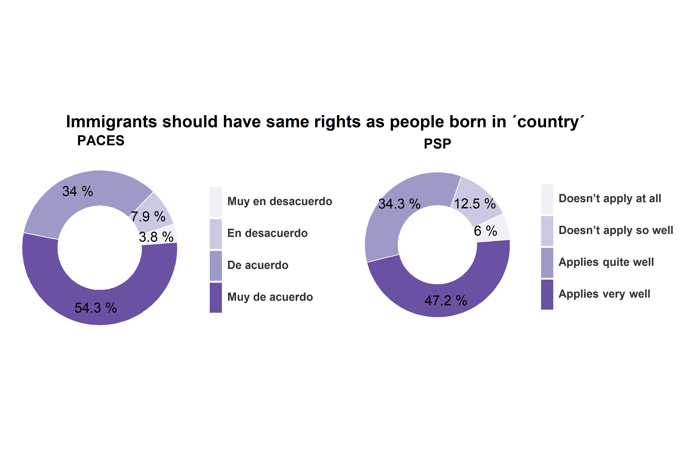


Los resultados de ambos gráficos permiten apreciar que no existe una diferencia valórica entre los jóvenes suecos y chilenos respecto a la igualdad de derechos. Más bien los patrones de respuesta son bastante similares. Existen pequeñas diferencias según las cuales en chile los jóvenes son levemente más propensos a justificar la desigualdad de género, mientras los jóvenes de Suecia más propensos a justificar la desigualdad en derechos con los inmigrantes.


####  Igualdad de derechos entre generos

```{r include=FALSE, results='hide'}
# paces

data_paces_sat=data_paces %>% select(P18G) %>% as.data.frame
data_paces_sat <- na.omit(data_paces_sat)
data_paces_sat$P18G <- factor(data_paces_sat$P18G, levels = c(1,2,3,4), labels = c("
  <br>
  <strong>
  Muy en desacuerdo</strong></b>
  <br>", "
  <br> 
  <strong>
  En desacuerdo</strong></b>
  <br>", "
  <br>
  <strong>
  De acuerdo </strong></b>
  <br>", "
  <br>
  <strong>
  Muy de acuerdo </strong></b>
  <br>"))
sat <- data_paces_sat %>%
  group_by("Alternativas"=P18G) %>%
  summarise(counts = n())
f_sat<-freq(data_paces_sat$P18G)
sat$prop<-f_sat[1:4,2]
sat <- sat %>%
  arrange(desc(Alternativas)) %>%
  mutate(
         lab.ypos = cumsum(prop) - 0.5*prop)
plot_sat <- ggplot(sat, aes(x = 2, y = prop, fill = Alternativas)) +
  geom_bar(stat = "identity", color = "white") +
  coord_polar(theta = "y", start = 1.5)+
  geom_text(aes(label = format(paste(round(prop,1),"%")), y = lab.ypos), color = "black", size=6) +
  scale_fill_brewer(palette = "Purples") +
  theme_void()+
  xlim(0.5, 2.5) +
  theme(legend.title = element_text(size=16, face="bold")) +
  theme(legend.text = element_markdown(colour = "grey20", size =14)) +
  ggtitle("<strong><span style='font-size:28px'> Women should have the same rights as men </span></strong><br> <br> <br>",subtitle = "<strong><span style='font-size:23px'>PACES</span></strong>") +  
  theme(plot.title = element_markdown(hjust=-1),
       #legend.direction = "horizontal",
       #legend.position = "bottom",
#       legend.position=c(1,0),
#              legend.position = c(.95, .95),
    legend.justification = c("left"),#, "top"),
    legend.box.just = "left",
    legend.margin = margin(6, 6, 6, 6),
    plot.subtitle = element_markdown(hjust = 0.5),
       legend.title = element_blank())

######################################
# psp
######################################


data_psp_sat=data_psp %>% select(jam1) %>% as.data.frame
data_psp_sat <- na.omit(data_psp_sat)
#data_psp_sat$jam1 <- factor(data_psp_sat$jam1, levels = c(4,3,2,1), labels = c("
data_psp_sat$jam1 <- factor(data_psp_sat$jam1, levels = c(4,3,2,1), labels = c("
  <br>
  <strong>
  Disagree absolutely </strong></b>
  <br>", "
  <br> 
  <strong>
  Disagree </strong></b>
  <br>", "
  <br>
  <strong>
  Agree </strong></b>
  <br>", "
  <br>
  <strong>
  Agree absolutely </strong></b>
  <br>"))
sat <- data_psp_sat %>%
  group_by("Alternativas"=jam1) %>%
  summarise(counts = n())
f_sat<-freq(data_psp_sat$jam1)
sat$prop<-f_sat[1:4,2]
sat <- sat %>%
  arrange(desc(Alternativas)) %>%
  mutate(
         lab.ypos = cumsum(prop) - 0.5*prop)
plot_sat_psp <- ggplot(sat, aes(x = 2, y = prop, fill = Alternativas)) +
  geom_bar(stat = "identity", color = "white") +
  coord_polar(theta = "y", start = 1.5)+
  geom_text(aes(label = format(paste(round(prop,1),"%")), y = lab.ypos), color = "black", size=6) +
  scale_fill_brewer(palette = "Purples") +#, 
                    #guide = guide_legend(reverse = TRUE)) +#,
                    #direction=-1) +
  theme_void()+
  xlim(0.5, 2.5) +
  theme(legend.title = element_text(size=16, face="bold")) +
  theme(legend.text = element_markdown(colour = "grey20", size =14)) +
  ggtitle(" ",subtitle="<br><br><strong><span style='font-size:23px'>PSP</span></strong>") +  
  theme(#legend.direction = "horizontal",
       #legend.position = "bottom",
#       legend.position=c(1,0),
#           legend.position = c(.95, .95),,
    legend.justification = c("left"),#, "top"),
    legend.box.just = "left",
    legend.margin = margin(6, 6, 6, 6),
    plot.subtitle = element_markdown(hjust = 0.5),
       legend.title = element_blank())

# Gráfico conjunto
plotdem <- cowplot::plot_grid(plot_sat,plot_sat_psp, ncol=2)
ggsave(plotdem, file = "output/plotdem.png",device = "png",width = 30,height = 20,dpi = "retina",units = "cm")
```

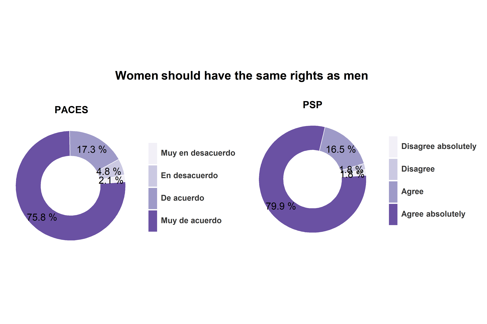


### Idea de un buen ciudadano


## Participación

#### Participación en la escuela


__Youth school political participation__


__Been a member of the student council__

```{r}

# paces
data_paces_sat=data_paces %>% select(P30C) %>% as.data.frame
data_paces_sat <- na.omit(data_paces_sat)
data_paces_sat$P30C <- factor(data_paces_sat$P30C, levels = c(1,2), labels = c("
  <br>
  <strong>
  Si </strong></b>
  <br>", "
  <br>
  <strong>
  No </strong></b>
  <br>"))
data_paces_sat <- na.omit(data_paces_sat)
sat <- data_paces_sat %>%
  group_by("Alternativas"=P30C) %>%
  summarise(counts = n())
f_sat<-freq(data_paces_sat$P30C)
sat$prop<-f_sat[1:2,2]
sat <- sat %>%
  arrange(desc(Alternativas)) %>%
  mutate(
         lab.ypos = cumsum(prop) - 0.5*prop)
plot_sat <- ggplot(sat, aes(x = 2, y = prop, fill = Alternativas)) +
  geom_bar(stat = "identity", color = "white") +
  coord_polar(theta = "y", start = 1.5)+
  geom_text(aes(label = format(paste(round(prop,1),"%")), y = lab.ypos), color = "black", size=6) +
  scale_fill_brewer(palette = "Purples") +
  theme_void()+
  xlim(0.5, 2.5) +
  theme(legend.title = element_text(size=16, face="bold")) +
  theme(legend.text = element_markdown(colour = "grey20", size =14)) +
  ggtitle("<strong><span style='font-size:28px'> Been a member of the student council? </strong> </span><br>", subtitle = "<strong><span style='font-size:23px'>PACES</span></strong>") +  
  theme(plot.title = element_markdown(hjust=-4),
       #legend.direction = "horizontal",
       #legend.position = "bottom",
#       legend.position=c(1,0),
#              legend.position = c(.95, .95),
    legend.justification = c("left"),#, "top"),
    legend.box.just = "left",
    legend.margin = margin(6, 6, 6, 6),
    plot.subtitle = element_markdown(hjust = 0.5),
       legend.title = element_blank())


#######################################################
# psp
#######################################################

#PRE6

data_psp_sat=data_psp %>% select(tr1) %>% as.data.frame
data_psp_sat <- na.omit(data_psp_sat)


#data_psp_sat$tr1 <- factor(data_psp_sat$tr1, levels = c(4,3,2,1), labels = c("
data_psp_sat$tr1 <- factor(data_psp_sat$tr1, levels = c(1,2), labels = c("
  <br>
  <strong>
  Yes  </strong></b>
  <br>", "
  <br>
  <strong>
  No <br> </strong></b>
  <br>"))
data_psp_sat <- na.omit(data_psp_sat)
  sat <- data_psp_sat %>%
  group_by("Alternativas"=tr1) %>%
  summarise(counts = n())
f_sat<-freq(data_psp_sat$tr1)
sat$prop<-f_sat[1:2,2]
sat <- sat %>%
  arrange(desc(Alternativas)) %>%
  mutate(
         lab.ypos = cumsum(prop) - 0.5*prop)
plot_sat_psp <- ggplot(sat, aes(x = 2, y = prop, fill = Alternativas)) +
  geom_bar(stat = "identity", color = "white") +
  coord_polar(theta = "y", start = 1.5)+
  geom_text(aes(label = format(paste(round(prop,1),"%")), y = lab.ypos), color = "black", size=6) +
  scale_fill_brewer(palette = "Purples") +#,
                    #guide = guide_legend(reverse = TRUE)) +#,
                    #direction=-1) +
  theme_void()+
  xlim(0.5, 2.5) +
  theme(legend.title = element_text(size=16, face="bold")) +
  theme(legend.text = element_markdown(colour = "grey20", size =14)) +
  ggtitle("<b>",subtitle = "<strong><span style='font-size:23px'>PSP</span></strong>") +
  theme(plot.title = element_markdown(hjust=0.0),
       #legend.direction = "horizontal",
       #legend.position = "bottom",
#       legend.position=c(1,0),
#              legend.position = c(.95, .95),
    legend.justification = c("left"),#, "top"),
    legend.box.just = "left",
    legend.margin = margin(6, 6, 6, 6),
    plot.subtitle = element_markdown(hjust = 0.5),
       legend.title = element_blank())

# Gráfico conjunto
plottr<- cowplot::plot_grid(plot_sat,plot_sat_psp, ncol=2)
ggsave(plottr, file = "output/plottr.png",device = "png",width = 30,height = 20,dpi = "retina",units = "cm")

```


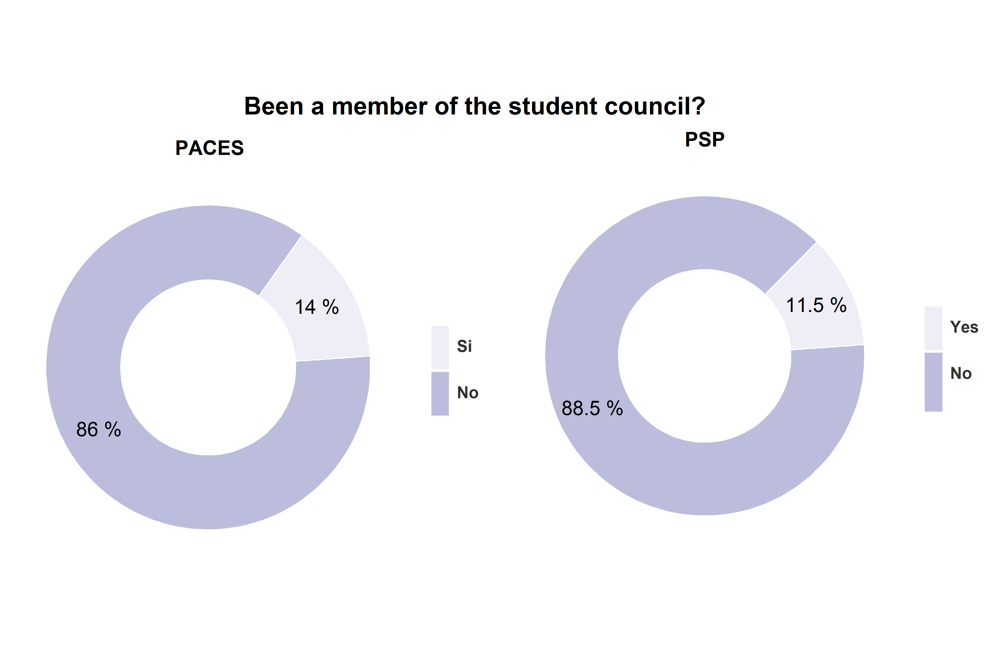

__Taken an active role at a students’ meeting?__

```{r}

# paces
data_paces_sat=data_paces %>% select(P30E) %>% as.data.frame
data_paces_sat <- na.omit(data_paces_sat)
data_paces_sat$P30E <- factor(data_paces_sat$P30E, levels = c(1,2), labels = c("
  <br>
  <strong>
  Si </strong></b>
  <br>", "
  <br>
  <strong>
  No </strong></b>
  <br>"))
data_paces_sat <- na.omit(data_paces_sat)
sat <- data_paces_sat %>%
  group_by("Alternativas"=P30E) %>%
  summarise(counts = n())
f_sat<-freq(data_paces_sat$P30E)
sat$prop<-f_sat[1:2,2]
sat <- sat %>%
  arrange(desc(Alternativas)) %>%
  mutate(
         lab.ypos = cumsum(prop) - 0.5*prop)
plot_sat <- ggplot(sat, aes(x = 2, y = prop, fill = Alternativas)) +
  geom_bar(stat = "identity", color = "white") +
  coord_polar(theta = "y", start = 1.5)+
  geom_text(aes(label = format(paste(round(prop,1),"%")), y = lab.ypos), color = "black", size=6) +
  scale_fill_brewer(palette = "Purples") +
  theme_void()+
  xlim(0.5, 2.5) +
  theme(legend.title = element_text(size=16, face="bold")) +
  theme(legend.text = element_markdown(colour = "grey20", size =14)) +
  ggtitle("<strong><span style='font-size:28px'> Taken an active role at a students’ meeting? </strong> </span><br>", subtitle = "<strong><span style='font-size:23px'>PACES</span></strong>") +  
  theme(plot.title = element_markdown(hjust=-2),
       #legend.direction = "horizontal",
       #legend.position = "bottom",
#       legend.position=c(1,0),
#              legend.position = c(.95, .95),
    legend.justification = c("left"),#, "top"),
    legend.box.just = "left",
    legend.margin = margin(6, 6, 6, 6),
    plot.subtitle = element_markdown(hjust = 0.5),
       legend.title = element_blank())


#######################################################
# psp
#######################################################

#PRE6

data_psp_sat=data_psp %>% select(tr4) %>% as.data.frame
data_psp_sat <- na.omit(data_psp_sat)


#data_psp_sat$tr4 <- factor(data_psp_sat$tr4, levels = c(4,3,2,1), labels = c("
data_psp_sat$tr4 <- factor(data_psp_sat$tr4, levels = c(1,2), labels = c("
  <br>
  <strong>
  Yes  </strong></b>
  <br>", "
  <br>
  <strong>
  No <br> </strong></b>
  <br>"))
data_psp_sat <- na.omit(data_psp_sat)
  sat <- data_psp_sat %>%
  group_by("Alternativas"=tr4) %>%
  summarise(counts = n())
f_sat<-freq(data_psp_sat$tr4)
sat$prop<-f_sat[1:2,2]
sat <- sat %>%
  arrange(desc(Alternativas)) %>%
  mutate(
         lab.ypos = cumsum(prop) - 0.5*prop)
plot_sat_psp <- ggplot(sat, aes(x = 2, y = prop, fill = Alternativas)) +
  geom_bar(stat = "identity", color = "white") +
  coord_polar(theta = "y", start = 1.5)+
  geom_text(aes(label = format(paste(round(prop,1),"%")), y = lab.ypos), color = "black", size=6) +
  scale_fill_brewer(palette = "Purples") +#,
                    #guide = guide_legend(reverse = TRUE)) +#,
                    #direction=-1) +
  theme_void()+
  xlim(0.5, 2.5) +
  theme(legend.title = element_text(size=16, face="bold")) +
  theme(legend.text = element_markdown(colour = "grey20", size =14)) +
  ggtitle("<b>",subtitle = "<strong><span style='font-size:23px'>PSP</span></strong>") +
  theme(plot.title = element_markdown(hjust=0.0),
       #legend.direction = "horizontal",
       #legend.position = "bottom",
#       legend.position=c(1,0),
#              legend.position = c(.95, .95),
    legend.justification = c("left"),#, "top"),
    legend.box.just = "left",
    legend.margin = margin(6, 6, 6, 6),
    plot.subtitle = element_markdown(hjust = 0.5),
       legend.title = element_blank())

# Gráfico conjunto
plottr2<- cowplot::plot_grid(plot_sat,plot_sat_psp, ncol=2)
ggsave(plottr2, file = "output/plottr2.png",device = "png",width = 30,height = 20,dpi = "retina",units = "cm")

```
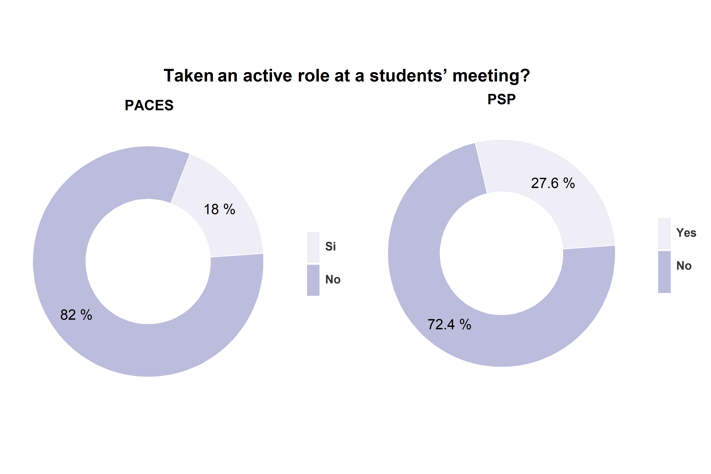


__Voted in a school election?__

```{r}

# paces
data_paces_sat=data_paces %>% select(P30A) %>% as.data.frame
data_paces_sat <- na.omit(data_paces_sat)
data_paces_sat$P30A <- factor(data_paces_sat$P30A, levels = c(1,2), labels = c("
  <br>
  <strong>
  Si </strong></b>
  <br>", "
  <br>
  <strong>
  No </strong></b>
  <br>"))
data_paces_sat <- na.omit(data_paces_sat)
sat <- data_paces_sat %>%
  group_by("Alternativas"=P30A) %>%
  summarise(counts = n())
f_sat<-freq(data_paces_sat$P30A)
sat$prop<-f_sat[1:2,2]
sat <- sat %>%
  arrange(desc(Alternativas)) %>%
  mutate(
         lab.ypos = cumsum(prop) - 0.5*prop)
plot_sat <- ggplot(sat, aes(x = 2, y = prop, fill = Alternativas)) +
  geom_bar(stat = "identity", color = "white") +
  coord_polar(theta = "y", start = 1.5)+
  geom_text(aes(label = format(paste(round(prop,1),"%")), y = lab.ypos), color = "black", size=6) +
  scale_fill_brewer(palette = "Purples") +
  theme_void()+
  xlim(0.5, 2.5) +
  theme(legend.title = element_text(size=16, face="bold")) +
  theme(legend.text = element_markdown(colour = "grey20", size =14)) +
  ggtitle("<strong><span style='font-size:28px'> Voted in a school election? </strong> </span><br>", subtitle = "<strong><span style='font-size:23px'>PACES</span></strong>") +  
  theme(plot.title = element_markdown(hjust=3.5),
       #legend.direction = "horizontal",
       #legend.position = "bottom",
#       legend.position=c(1,0),
#              legend.position = c(.95, .95),
    legend.justification = c("left"),#, "top"),
    legend.box.just = "left",
    legend.margin = margin(6, 6, 6, 6),
    plot.subtitle = element_markdown(hjust = 0.5),
       legend.title = element_blank())


#######################################################
# psp
#######################################################

#PRE6

data_psp_sat=data_psp %>% select(tr7) %>% as.data.frame
data_psp_sat <- na.omit(data_psp_sat)


#data_psp_sat$tr7 <- factor(data_psp_sat$tr7, levels = c(4,3,2,1), labels = c("
data_psp_sat$tr7 <- factor(data_psp_sat$tr7, levels = c(1,2), labels = c("
  <br>
  <strong>
  Yes  </strong></b>
  <br>", "
  <br>
  <strong>
  No <br> </strong></b>
  <br>"))
data_psp_sat <- na.omit(data_psp_sat)
  sat <- data_psp_sat %>%
  group_by("Alternativas"=tr7) %>%
  summarise(counts = n())
f_sat<-freq(data_psp_sat$tr7)
sat$prop<-f_sat[1:2,2]
sat <- sat %>%
  arrange(desc(Alternativas)) %>%
  mutate(
         lab.ypos = cumsum(prop) - 0.5*prop)
plot_sat_psp <- ggplot(sat, aes(x = 2, y = prop, fill = Alternativas)) +
  geom_bar(stat = "identity", color = "white") +
  coord_polar(theta = "y", start = 1.5)+
  geom_text(aes(label = format(paste(round(prop,1),"%")), y = lab.ypos), color = "black", size=6) +
  scale_fill_brewer(palette = "Purples") +#,
                    #guide = guide_legend(reverse = TRUE)) +#,
                    #direction=-1) +
  theme_void()+
  xlim(0.5, 2.5) +
  theme(legend.title = element_text(size=16, face="bold")) +
  theme(legend.text = element_markdown(colour = "grey20", size =14)) +
  ggtitle("<b>",subtitle = "<strong><span style='font-size:23px'>PSP</span></strong>") +
  theme(plot.title = element_markdown(hjust=0.0),
       #legend.direction = "horizontal",
       #legend.position = "bottom",
#       legend.position=c(1,0),
#              legend.position = c(.95, .95),
    legend.justification = c("left"),#, "top"),
    legend.box.just = "left",
    legend.margin = margin(6, 6, 6, 6),
    plot.subtitle = element_markdown(hjust = 0.5),
       legend.title = element_blank())

# Gráfico conjunto
plottr3<- cowplot::plot_grid(plot_sat,plot_sat_psp, ncol=2)
ggsave(plottr3, file = "output/plottr3.png",device = "png",width = 30,height = 20,dpi = "retina",units = "cm")

```
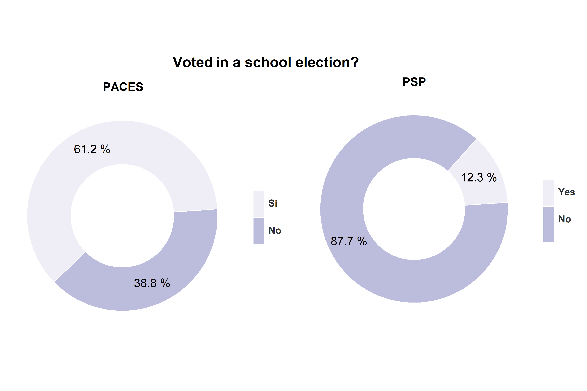


__Participated in a protest at school?__

```{r}

# paces
data_paces_sat=data_paces %>% select(P30D) %>% as.data.frame
data_paces_sat <- na.omit(data_paces_sat)
data_paces_sat$P30D <- factor(data_paces_sat$P30D, levels = c(1,2), labels = c("
  <br>
  <strong>
  Si </strong></b>
  <br>", "
  <br>
  <strong>
  No </strong></b>
  <br>"))
data_paces_sat <- na.omit(data_paces_sat)
sat <- data_paces_sat %>%
  group_by("Alternativas"=P30D) %>%
  summarise(counts = n())
f_sat<-freq(data_paces_sat$P30D)
sat$prop<-f_sat[1:2,2]
sat <- sat %>%
  arrange(desc(Alternativas)) %>%
  mutate(
         lab.ypos = cumsum(prop) - 0.5*prop)
plot_sat <- ggplot(sat, aes(x = 2, y = prop, fill = Alternativas)) +
  geom_bar(stat = "identity", color = "white") +
  coord_polar(theta = "y", start = 1.5)+
  geom_text(aes(label = format(paste(round(prop,1),"%")), y = lab.ypos), color = "black", size=6) +
  scale_fill_brewer(palette = "Purples") +
  theme_void()+
  xlim(0.5, 2.5) +
  theme(legend.title = element_text(size=16, face="bold")) +
  theme(legend.text = element_markdown(colour = "grey20", size =14)) +
  ggtitle("<strong><span style='font-size:28px'> Participated in a protest at school?					 </strong> </span><br>", subtitle = "<strong><span style='font-size:23px'>PACES</span></strong>") +  
  theme(plot.title = element_markdown(hjust=-25),
       #legend.direction = "horizontal",
       #legend.position = "bottom",
#       legend.position=c(1,0),
#              legend.position = c(.95, .95),
    legend.justification = c("left"),#, "top"),
    legend.box.just = "left",
    legend.margin = margin(6, 6, 6, 6),
    plot.subtitle = element_markdown(hjust = 0.5),
       legend.title = element_blank())


#######################################################
# psp
#######################################################

#PRE6

data_psp_sat=data_psp %>% select(tr5) %>% as.data.frame
data_psp_sat <- na.omit(data_psp_sat)


#data_psp_sat$tr5 <- factor(data_psp_sat$tr5, levels = c(4,3,2,1), labels = c("
data_psp_sat$tr5 <- factor(data_psp_sat$tr5, levels = c(1,2), labels = c("
  <br>
  <strong>
  Yes  </strong></b>
  <br>", "
  <br>
  <strong>
  No <br> </strong></b>
  <br>"))
data_psp_sat <- na.omit(data_psp_sat)
  sat <- data_psp_sat %>%
  group_by("Alternativas"=tr5) %>%
  summarise(counts = n())
f_sat<-freq(data_psp_sat$tr5)
sat$prop<-f_sat[1:2,2]
sat <- sat %>%
  arrange(desc(Alternativas)) %>%
  mutate(
         lab.ypos = cumsum(prop) - 0.5*prop)
plot_sat_psp <- ggplot(sat, aes(x = 2, y = prop, fill = Alternativas)) +
  geom_bar(stat = "identity", color = "white") +
  coord_polar(theta = "y", start = 1.5)+
  geom_text(aes(label = format(paste(round(prop,1),"%")), y = lab.ypos), color = "black", size=6) +
  scale_fill_brewer(palette = "Purples") +#,
                    #guide = guide_legend(reverse = TRUE)) +#,
                    #direction=-1) +
  theme_void()+
  xlim(0.5, 2.5) +
  theme(legend.title = element_text(size=16, face="bold")) +
  theme(legend.text = element_markdown(colour = "grey20", size =14)) +
  ggtitle("<b>",subtitle = "<strong><span style='font-size:23px'>PSP</span></strong>") +
  theme(plot.title = element_markdown(hjust=0.0),
       #legend.direction = "horizontal",
       #legend.position = "bottom",
#       legend.position=c(1,0),
#              legend.position = c(.95, .95),
    legend.justification = c("left"),#, "top"),
    legend.box.just = "left",
    legend.margin = margin(6, 6, 6, 6),
    plot.subtitle = element_markdown(hjust = 0.5),
       legend.title = element_blank())

# Gráfico conjunto
plottr4<- cowplot::plot_grid(plot_sat,plot_sat_psp, ncol=2)
ggsave(plottr4, file = "output/plottr4.png",device = "png",width = 30,height = 20,dpi = "retina",units = "cm")

```


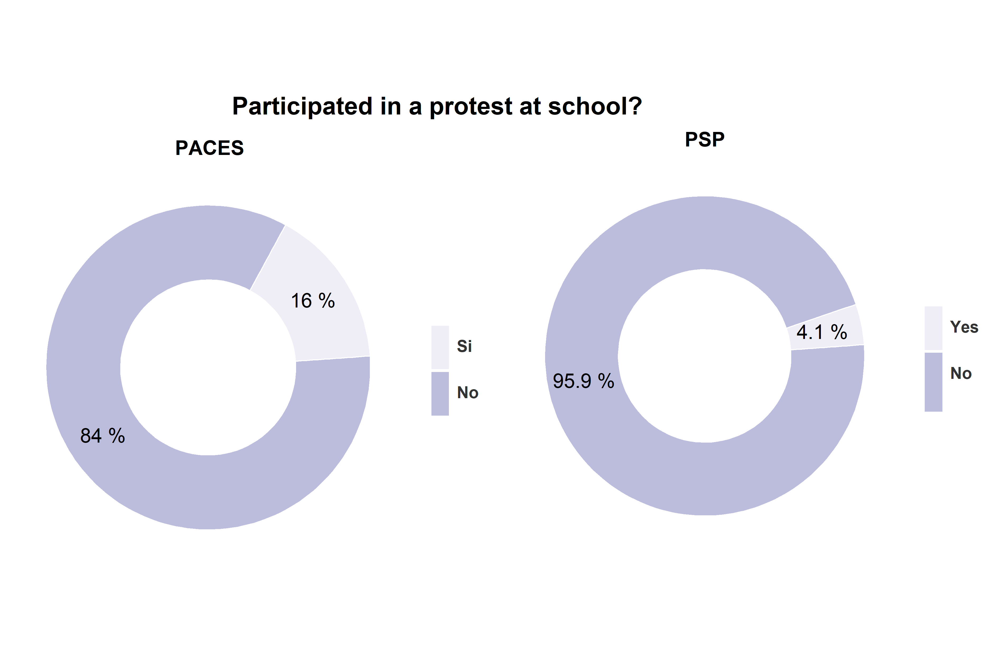


#### Practicas en la escuela 

Se observa una alta participación democratica en la escuela 

```{r, include=TRUE}
  iccs_chsw %>% na.omit() %>% group_by(COUNTRY,IS3G16A) %>% summarise(n=n()) %>%  mutate(freq = round(n / sum(n), 3)) %>% ggplot(aes(x=freq, y=as.character(IS3G16A), fill=COUNTRY)) + geom_bar(stat = "identity",position=position_dodge()) + scale_y_discrete(labels=c("Este año",  "Hace más de un año","Nunca")) +ggtitle("Tu Escuela/En la escuela, ¿alguna vez has hecho/Participación activa en un debate organizado")
```


```{r, include=TRUE}
  iccs_chsw %>% na.omit() %>% group_by(COUNTRY,IS3G16C) %>% summarise(n=n()) %>%  mutate(freq = round(n / sum(n), 3)) %>% ggplot(aes(x=freq, y=as.character(IS3G16C), fill=COUNTRY)) + geom_bar(stat = "identity",position=position_dodge()) + scale_y_discrete(labels=c("Este año",  "Hace más de un año","Nunca")) +ggtitle("En la escuela ¿alguna vez has hecho/Participación activa en un debate organizado")
```


#### Participación publica


__Youth participation__

__Signed a petition?__

```{r}

# paces
data_paces_sat=data_paces %>% select(P33A) %>% as.data.frame
data_paces_sat <- na.omit(data_paces_sat)
data_paces_sat$P33A <- factor(data_paces_sat$P33A, levels = c(1,2), labels = c("
  <br>
  <strong>
  Si <span style='color:#FFFFFF'>several times</span></strong></b>
  <br>", "
  <br>
  <strong>
  No </strong></b>
  <br>"))
data_paces_sat <- na.omit(data_paces_sat)
sat <- data_paces_sat %>%
  group_by("Alternativas"=P33A) %>%
  summarise(counts = n())
f_sat<-freq(data_paces_sat$P33A)
sat$prop<-f_sat[1:2,2]
sat <- sat %>%
  arrange(desc(Alternativas)) %>%
  mutate(
         lab.ypos = cumsum(prop) - 0.5*prop)
plot_sat <- ggplot(sat, aes(x = 2, y = prop, fill = Alternativas)) +
  geom_bar(stat = "identity", color = "white") +
  coord_polar(theta = "y", start = 1.5)+
  geom_text(aes(label = format(paste(round(prop,1),"%")), y = lab.ypos), color = "black", size=6) +
  scale_fill_brewer(palette = "Purples") +
  theme_void()+
  xlim(0.5, 2.5) +
  theme(legend.title = element_text(size=16, face="bold")) +
  theme(legend.text = element_markdown(colour = "grey20", size =14)) +
  ggtitle("<strong><span style='font-size:28px'> Signed a petition? </strong> </span><br>", subtitle = "<strong><span style='font-size:23px'>PACES</span></strong>") +  
  theme(plot.title = element_markdown(hjust=4),
       #legend.direction = "horizontal",
       #legend.position = "bottom",
#       legend.position=c(1,0),
#              legend.position = c(.95, .95),
    legend.justification = c("left"),#, "top"),
    legend.box.just = "left",
    legend.margin = margin(6, 6, 6, 6),
    plot.subtitle = element_markdown(hjust = 0.5),
       legend.title = element_blank())


#######################################################
# psp
#######################################################

#PRE6

data_psp_sat=data_psp %>% select(ps88) %>% as.data.frame
data_psp_sat <- na.omit(data_psp_sat)


#data_psp_sat$ps88 <- factor(data_psp_sat$ps88, levels = c(4,3,2,1), labels = c("
data_psp_sat$ps88 <- factor(data_psp_sat$ps88, levels = c(3,2,1), labels = c("
  <br>
  <strong>
  Yes, several times <br> </strong></b>
  <br>", "
  <br>
  <strong>
  Yes, occasionally <br> </strong></b>
  <br>","
  <br>
  <strong>
  No  </strong></b>
  <br>"))
data_psp_sat <- na.omit(data_psp_sat)
  sat <- data_psp_sat %>%
  group_by("Alternativas"=ps88) %>%
  summarise(counts = n())
f_sat<-freq(data_psp_sat$ps88)
sat$prop<-f_sat[1:3,2]
sat <- sat %>%
  arrange(desc(Alternativas)) %>%
  mutate(
         lab.ypos = cumsum(prop) - 0.5*prop)
plot_sat_psp <- ggplot(sat, aes(x = 2, y = prop, fill = Alternativas)) +
  geom_bar(stat = "identity", color = "white") +
  coord_polar(theta = "y", start = 1.5)+
  geom_text(aes(label = format(paste(round(prop,1),"%")), y = lab.ypos), color = "black", size=6) +
  scale_fill_brewer(palette = "Purples") +#,
                    #guide = guide_legend(reverse = TRUE)) +#,
                    #direction=-1) +
  theme_void()+
  xlim(0.5, 2.5) +
  theme(legend.title = element_text(size=16, face="bold")) +
  theme(legend.text = element_markdown(colour = "grey20", size =14)) +
  ggtitle("<b>",subtitle = "<strong><span style='font-size:23px'>PSP</span></strong>") +
  theme(plot.title = element_markdown(hjust=0.0),
       #legend.direction = "horizontal",
       #legend.position = "bottom",
#       legend.position=c(1,0),
#              legend.position = c(.95, .95),
    legend.justification = c("left"),#, "top"),
    legend.box.just = "left",
    legend.margin = margin(6, 6, 6, 6),
    plot.subtitle = element_markdown(hjust = 0.5),
       legend.title = element_blank())

# Gráfico conjunto
plotyp1<- cowplot::plot_grid(plot_sat,plot_sat_psp, ncol=2)
ggsave(plotyp1, file = "output/plotyp1.png",device = "png",width = 30,height = 20,dpi = "retina",units = "cm")

```
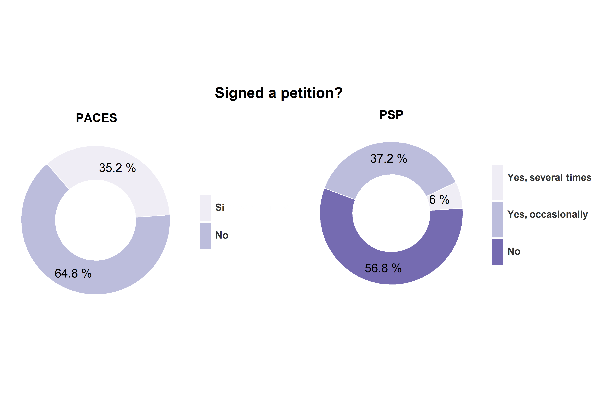


__Worked voluntarily for a good cause?__


```{r}

# paces
data_paces_sat=data_paces %>% select(P33F) %>% as.data.frame
data_paces_sat <- na.omit(data_paces_sat)
data_paces_sat$P33F <- factor(data_paces_sat$P33F, levels = c(1,2), labels = c("
  <br>
  <strong>
  Si <span style='color:#FFFFFF'>several times</span></strong></b>
  <br>", "
  <br>
  <strong>
  No </strong></b>
  <br>"))
data_paces_sat <- na.omit(data_paces_sat)
sat <- data_paces_sat %>%
  group_by("Alternativas"=P33F) %>%
  summarise(counts = n())
f_sat<-freq(data_paces_sat$P33F)
sat$prop<-f_sat[1:2,2]
sat <- sat %>%
  arrange(desc(Alternativas)) %>%
  mutate(
         lab.ypos = cumsum(prop) - 0.5*prop)
plot_sat <- ggplot(sat, aes(x = 2, y = prop, fill = Alternativas)) +
  geom_bar(stat = "identity", color = "white") +
  coord_polar(theta = "y", start = 1.5)+
  geom_text(aes(label = format(paste(round(prop,1),"%")), y = lab.ypos), color = "black", size=6) +
  scale_fill_brewer(palette = "Purples") +
  theme_void()+
  xlim(0.5, 2.5) +
  theme(legend.title = element_text(size=16, face="bold")) +
  theme(legend.text = element_markdown(colour = "grey20", size =14)) +
  ggtitle("<strong><span style='font-size:28px'> Worked voluntarily for a good cause? </strong> </span><br>", subtitle = "<strong><span style='font-size:23px'>PACES</span></strong>") +  
  theme(plot.title = element_markdown(hjust=-1.5),
       #legend.direction = "horizontal",
       #legend.position = "bottom",
#       legend.position=c(1,0),
#              legend.position = c(.95, .95),
    legend.justification = c("left"),#, "top"),
    legend.box.just = "left",
    legend.margin = margin(6, 6, 6, 6),
    plot.subtitle = element_markdown(hjust = 0.5),
       legend.title = element_blank())


#######################################################
# psp
#######################################################

#PRE6

data_psp_sat=data_psp %>% select(ps3) %>% as.data.frame
data_psp_sat <- na.omit(data_psp_sat)


#data_psp_sat$ps3 <- factor(data_psp_sat$ps3, levels = c(4,3,2,1), labels = c("
data_psp_sat$ps3 <- factor(data_psp_sat$ps3, levels = c(3,2,1), labels = c("
  <br>
  <strong>
  Yes, several times <br> </strong></b>
  <br>", "
  <br>
  <strong>
  Yes, occasionally <br> </strong></b>
  <br>","
  <br>
  <strong>
  No  </strong></b>
  <br>"))
data_psp_sat <- na.omit(data_psp_sat)
  sat <- data_psp_sat %>%
  group_by("Alternativas"=ps3) %>%
  summarise(counts = n())
f_sat<-freq(data_psp_sat$ps3)
sat$prop<-f_sat[1:3,2]
sat <- sat %>%
  arrange(desc(Alternativas)) %>%
  mutate(
         lab.ypos = cumsum(prop) - 0.5*prop)
plot_sat_psp <- ggplot(sat, aes(x = 2, y = prop, fill = Alternativas)) +
  geom_bar(stat = "identity", color = "white") +
  coord_polar(theta = "y", start = 1.5)+
  geom_text(aes(label = format(paste(round(prop,1),"%")), y = lab.ypos), color = "black", size=6) +
  scale_fill_brewer(palette = "Purples") +#,
                    #guide = guide_legend(reverse = TRUE)) +#,
                    #direction=-1) +
  theme_void()+
  xlim(0.5, 2.5) +
  theme(legend.title = element_text(size=16, face="bold")) +
  theme(legend.text = element_markdown(colour = "grey20", size =14)) +
  ggtitle("<b>",subtitle = "<strong><span style='font-size:23px'>PSP</span></strong>") +
  theme(plot.title = element_markdown(hjust=0.0),
       #legend.direction = "horizontal",
       #legend.position = "bottom",
#       legend.position=c(1,0),
#              legend.position = c(.95, .95),
    legend.justification = c("left"),#, "top"),
    legend.box.just = "left",
    legend.margin = margin(6, 6, 6, 6),
    plot.subtitle = element_markdown(hjust = 0.5),
       legend.title = element_blank())

# Gráfico conjunto
plotyp2<- cowplot::plot_grid(plot_sat,plot_sat_psp, ncol=2)
ggsave(plotyp2, file = "output/plotyp2.png",device = "png",width = 30,height = 20,dpi = "retina",units = "cm")

```


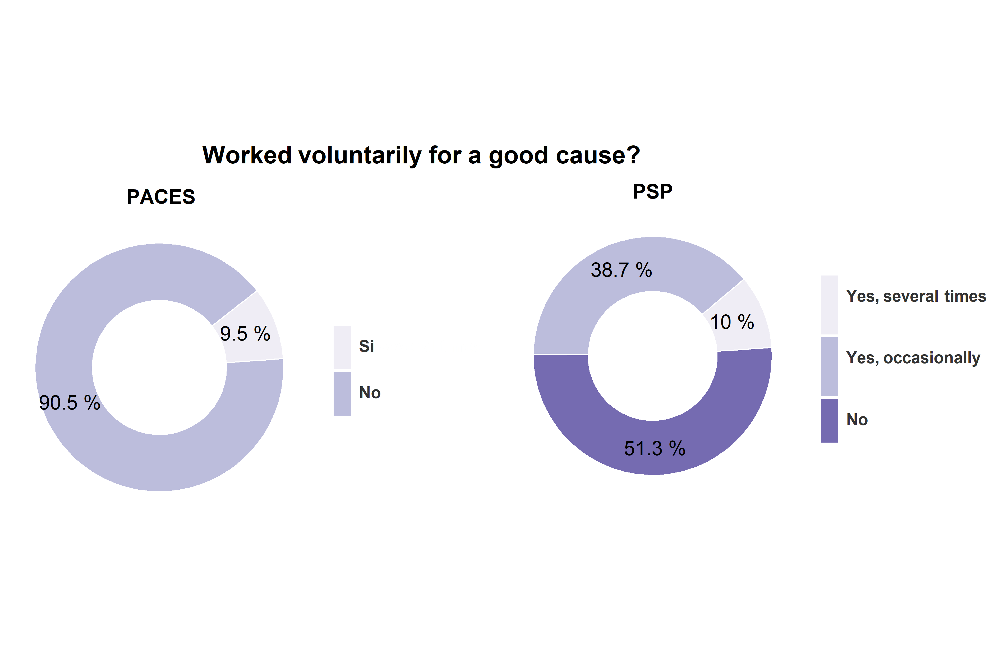


__Taken part in a legal demonstration or strike?__


```{r}

# paces
data_paces_sat=data_paces %>% select(P33B) %>% as.data.frame
data_paces_sat <- na.omit(data_paces_sat)
data_paces_sat$P33B <- factor(data_paces_sat$P33B, levels = c(1,2), labels = c("
  <br>
  <strong>
  Si <span style='color:#FFFFFF'>several times</span></strong></b>
  <br>", "
  <br>
  <strong>
  No </strong></b>
  <br>"))
data_paces_sat <- na.omit(data_paces_sat)
sat <- data_paces_sat %>%
  group_by("Alternativas"=P33B) %>%
  summarise(counts = n())
f_sat<-freq(data_paces_sat$P33B)
sat$prop<-f_sat[1:2,2]
sat <- sat %>%
  arrange(desc(Alternativas)) %>%
  mutate(
         lab.ypos = cumsum(prop) - 0.5*prop)
plot_sat <- ggplot(sat, aes(x = 2, y = prop, fill = Alternativas)) +
  geom_bar(stat = "identity", color = "white") +
  coord_polar(theta = "y", start = 1.5)+
  geom_text(aes(label = format(paste(round(prop,1),"%")), y = lab.ypos), color = "black", size=6) +
  scale_fill_brewer(palette = "Purples") +
  theme_void()+
  xlim(0.5, 2.5) +
  theme(legend.title = element_text(size=16, face="bold")) +
  theme(legend.text = element_markdown(colour = "grey20", size =14)) +
  ggtitle("<strong><span style='font-size:28px'> Taken part in a legal demonstration or strike? </strong> </span><br>", subtitle = "<strong><span style='font-size:23px'>PACES</span></strong>") +  
  theme(plot.title = element_markdown(hjust=-1),
       #legend.direction = "horizontal",
       #legend.position = "bottom",
#       legend.position=c(1,0),
#              legend.position = c(.95, .95),
    legend.justification = c("left"),#, "top"),
    legend.box.just = "left",
    legend.margin = margin(6, 6, 6, 6),
    plot.subtitle = element_markdown(hjust = 0.5),
       legend.title = element_blank())


#######################################################
# psp
#######################################################

#PRE6

data_psp_sat=data_psp %>% select(ps12) %>% as.data.frame
data_psp_sat <- na.omit(data_psp_sat)


#data_psp_sat$ps12 <- factor(data_psp_sat$ps12, levels = c(4,3,2,1), labels = c("
data_psp_sat$ps12 <- factor(data_psp_sat$ps12, levels = c(3,2,1), labels = c("
  <br>
  <strong>
  Yes, several times <br> </strong></b>
  <br>", "
  <br>
  <strong>
  Yes, occasionally <br> </strong></b>
  <br>","
  <br>
  <strong>
  No  </strong></b>
  <br>"))
data_psp_sat <- na.omit(data_psp_sat)
  sat <- data_psp_sat %>%
  group_by("Alternativas"=ps12) %>%
  summarise(counts = n())
f_sat<-freq(data_psp_sat$ps12)
sat$prop<-f_sat[1:3,2]
sat <- sat %>%
  arrange(desc(Alternativas)) %>%
  mutate(
         lab.ypos = cumsum(prop) - 0.5*prop)
plot_sat_psp <- ggplot(sat, aes(x = 2, y = prop, fill = Alternativas)) +
  geom_bar(stat = "identity", color = "white") +
  coord_polar(theta = "y", start = 1.5)+
  geom_text(aes(label = format(paste(round(prop,1),"%")), y = lab.ypos), color = "black", size=6) +
  scale_fill_brewer(palette = "Purples") +#,
                    #guide = guide_legend(reverse = TRUE)) +#,
                    #direction=-1) +
  theme_void()+
  xlim(0.5, 2.5) +
  theme(legend.title = element_text(size=16, face="bold")) +
  theme(legend.text = element_markdown(colour = "grey20", size =14)) +
  ggtitle("<b>",subtitle = "<strong><span style='font-size:23px'>PSP</span></strong>") +
  theme(plot.title = element_markdown(hjust=0.0),
       #legend.direction = "horizontal",
       #legend.position = "bottom",
#       legend.position=c(1,0),
#              legend.position = c(.95, .95),
    legend.justification = c("left"),#, "top"),
    legend.box.just = "left",
    legend.margin = margin(6, 6, 6, 6),
    plot.subtitle = element_markdown(hjust = 0.5),
       legend.title = element_blank())

# Gráfico conjunto
plotyp3<- cowplot::plot_grid(plot_sat,plot_sat_psp, ncol=2)
ggsave(plotyp3, file = "output/plotyp3.png",device = "png",width = 30,height = 20,dpi = "retina",units = "cm")

```


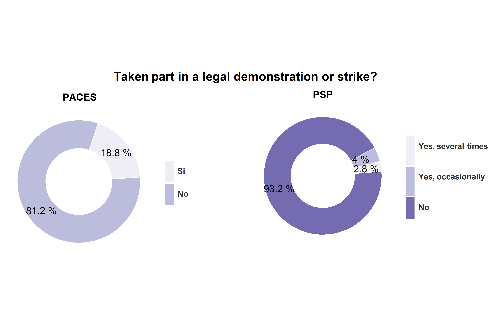


__Occupation__


```{r}

# paces
data_paces_sat=data_paces %>% select(P33D) %>% as.data.frame
data_paces_sat <- na.omit(data_paces_sat)
data_paces_sat$P33D <- factor(data_paces_sat$P33D, levels = c(1,2), labels = c("
  <br>
  <strong>
  Si <span style='color:#FFFFFF'>several times</span></strong></b>
  <br>", "
  <br>
  <strong>
  No </strong></b>
  <br>"))
data_paces_sat <- na.omit(data_paces_sat)
sat <- data_paces_sat %>%
  group_by("Alternativas"=P33D) %>%
  summarise(counts = n())
f_sat<-freq(data_paces_sat$P33D)
sat$prop<-f_sat[1:2,2]
sat <- sat %>%
  arrange(desc(Alternativas)) %>%
  mutate(
         lab.ypos = cumsum(prop) - 0.5*prop)
plot_sat <- ggplot(sat, aes(x = 2, y = prop, fill = Alternativas)) +
  geom_bar(stat = "identity", color = "white") +
  coord_polar(theta = "y", start = 1.5)+
  geom_text(aes(label = format(paste(round(prop,1),"%")), y = lab.ypos), color = "black", size=6) +
  scale_fill_brewer(palette = "Purples") +
  theme_void()+
  xlim(0.5, 2.5) +
  theme(legend.title = element_text(size=16, face="bold")) +
  theme(legend.text = element_markdown(colour = "grey20", size =14)) +
  ggtitle("<span style='font-size:24px'> Participar en una toma </strong> </span><br>", subtitle = "<strong><span style='font-size:23px'>PACES</span></strong>") +  
  theme(plot.title = element_markdown(hjust=0.5),
       #legend.direction = "horizontal",
       #legend.position = "bottom",
#       legend.position=c(1,0),
#              legend.position = c(.95, .95),
    legend.justification = c("left"),#, "top"),
    legend.box.just = "left",
    legend.margin = margin(6, 6, 6, 6),
    plot.subtitle = element_markdown(hjust = 0.5),
       legend.title = element_blank())


#######################################################
# psp
#######################################################

#PRE6

data_psp_sat=data_psp %>% select(ps133) %>% as.data.frame
data_psp_sat <- na.omit(data_psp_sat)


#data_psp_sat$ps133 <- factor(data_psp_sat$ps133, levels = c(4,3,2,1), labels = c("
data_psp_sat$ps133 <- factor(data_psp_sat$ps133, levels = c(3,2,1), labels = c("
  <br>
  <strong>
  Yes, several times <br> </strong></b>
  <br>", "
  <br>
  <strong>
  Yes, occasionally <br> </strong></b>
  <br>","
  <br>
  <strong>
  No  </strong></b>
  <br>"))
data_psp_sat <- na.omit(data_psp_sat)
  sat <- data_psp_sat %>%
  group_by("Alternativas"=ps133) %>%
  summarise(counts = n())
f_sat<-freq(data_psp_sat$ps133)
sat$prop<-f_sat[1:3,2]
sat <- sat %>%
  arrange(desc(Alternativas)) %>%
  mutate(
         lab.ypos = cumsum(prop) - 0.5*prop)
plot_sat_psp <- ggplot(sat, aes(x = 2, y = prop, fill = Alternativas)) +
  geom_bar(stat = "identity", color = "white") +
  coord_polar(theta = "y", start = 1.5)+
  geom_text(aes(label = format(paste(round(prop,1),"%")), y = lab.ypos), color = "black", size=6) +
  scale_fill_brewer(palette = "Purples") +#,
                    #guide = guide_legend(reverse = TRUE)) +#,
                    #direction=-1) +
  theme_void()+
  xlim(0.5, 2.5) +
  theme(legend.title = element_text(size=16, face="bold")) +
  theme(legend.text = element_markdown(colour = "grey20", size =14)) +
  ggtitle("<span style='font-size:24px'> Taken part in an illegal action/demonstration <br> or occupation? </strong> </span><br>",subtitle = "<strong><span style='font-size:23px'>PSP</span></strong>") +
  theme(plot.title = element_markdown(hjust=0.0),
       #legend.direction = "horizontal",
       #legend.position = "bottom",
#       legend.position=c(1,0),
#              legend.position = c(.95, .95),
    legend.justification = c("left"),#, "top"),
    legend.box.just = "left",
    legend.margin = margin(6, 6, 6, 6),
    plot.subtitle = element_markdown(hjust = 0.5),
       legend.title = element_blank())

# Gráfico conjunto
plotyp4<- cowplot::plot_grid(plot_sat,plot_sat_psp, ncol=2)
ggsave(plotyp4, file = "output/plotyp4.png",device = "png",width = 30,height = 20,dpi = "retina",units = "cm")

```
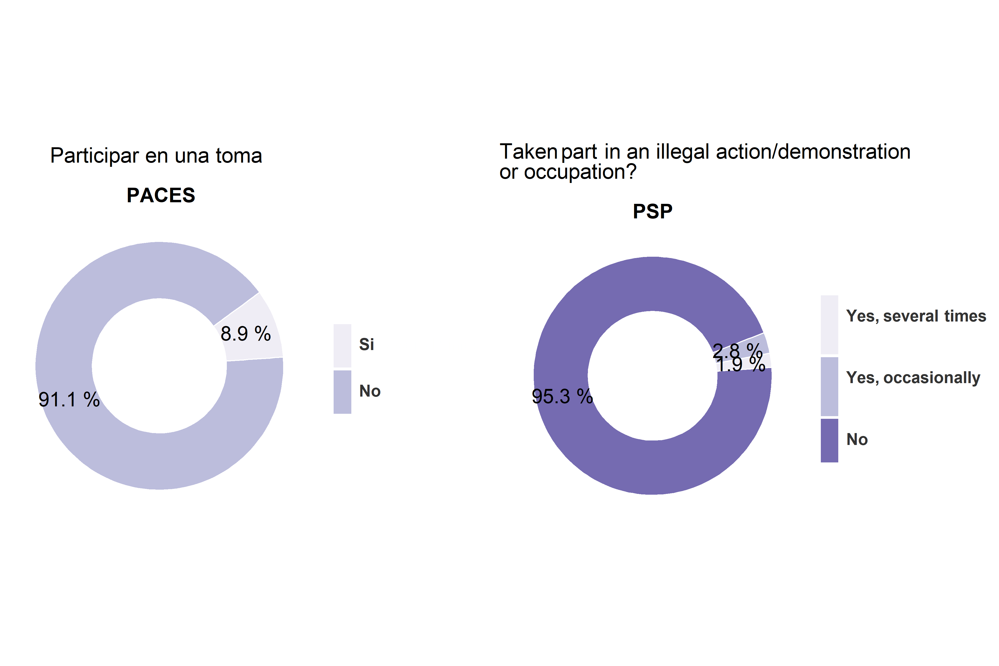


__Ilegal strike__


```{r}

# paces
data_paces_sat=data_paces %>% select(P33C) %>% as.data.frame
data_paces_sat <- na.omit(data_paces_sat)
data_paces_sat$P33C <- factor(data_paces_sat$P33C, levels = c(1,2), labels = c("
  <br>
  <strong>
  Si <span style='color:#FFFFFF'>several times</span></strong></b>
  <br>", "
  <br>
  <strong>
  No </strong></b>
  <br>"))
data_paces_sat <- na.omit(data_paces_sat)
sat <- data_paces_sat %>%
  group_by("Alternativas"=P33C) %>%
  summarise(counts = n())
f_sat<-freq(data_paces_sat$P33C)
sat$prop<-f_sat[1:2,2]
sat <- sat %>%
  arrange(desc(Alternativas)) %>%
  mutate(
         lab.ypos = cumsum(prop) - 0.5*prop)
plot_sat <- ggplot(sat, aes(x = 2, y = prop, fill = Alternativas)) +
  geom_bar(stat = "identity", color = "white") +
  coord_polar(theta = "y", start = 1.5)+
  geom_text(aes(label = format(paste(round(prop,1),"%")), y = lab.ypos), color = "black", size=6) +
  scale_fill_brewer(palette = "Purples") +
  theme_void()+
  xlim(0.5, 2.5) +
  theme(legend.title = element_text(size=16, face="bold")) +
  theme(legend.text = element_markdown(colour = "grey20", size =14)) +
  ggtitle("<span style='font-size:24px'> Participar en una marcha o manifestación <br> que resultó en destrucción de propiedad </strong> </span><br>", subtitle = "<strong><span style='font-size:23px'>PACES</span></strong>") +  
  theme(plot.title = element_markdown(hjust=0),
       #legend.direction = "horizontal",
       #legend.position = "bottom",
#       legend.position=c(1,0),
#              legend.position = c(.95, .95),
    legend.justification = c("left"),#, "top"),
    legend.box.just = "left",
    legend.margin = margin(6, 6, 6, 6),
    plot.subtitle = element_markdown(hjust = 0.5),
       legend.title = element_blank())


#######################################################
# psp
#######################################################

#PRE6

data_psp_sat=data_psp %>% select(ps133) %>% as.data.frame
data_psp_sat <- na.omit(data_psp_sat)


#data_psp_sat$ps133 <- factor(data_psp_sat$ps133, levels = c(4,3,2,1), labels = c("
data_psp_sat$ps133 <- factor(data_psp_sat$ps133, levels = c(3,2,1), labels = c("
  <br>
  <strong>
  Yes, several times <br> </strong></b>
  <br>", "
  <br>
  <strong>
  Yes, occasionally <br> </strong></b>
  <br>","
  <br>
  <strong>
  No  </strong></b>
  <br>"))
data_psp_sat <- na.omit(data_psp_sat)
  sat <- data_psp_sat %>%
  group_by("Alternativas"=ps133) %>%
  summarise(counts = n())
f_sat<-freq(data_psp_sat$ps133)
sat$prop<-f_sat[1:3,2]
sat <- sat %>%
  arrange(desc(Alternativas)) %>%
  mutate(
         lab.ypos = cumsum(prop) - 0.5*prop)
plot_sat_psp <- ggplot(sat, aes(x = 2, y = prop, fill = Alternativas)) +
  geom_bar(stat = "identity", color = "white") +
  coord_polar(theta = "y", start = 1.5)+
  geom_text(aes(label = format(paste(round(prop,1),"%")), y = lab.ypos), color = "black", size=6) +
  scale_fill_brewer(palette = "Purples") +#,
                    #guide = guide_legend(reverse = TRUE)) +#,
                    #direction=-1) +
  theme_void()+
  xlim(0.5, 2.5) +
  theme(legend.title = element_text(size=16, face="bold")) +
  theme(legend.text = element_markdown(colour = "grey20", size =14)) +
  ggtitle("<span style='font-size:24px'> Taken part in an illegal action/demonstration <br>or occupation? </strong> </span><br>",subtitle = "<strong><span style='font-size:23px'>PSP</span></strong>") +
  theme(plot.title = element_markdown(hjust=0.0),
       #legend.direction = "horizontal",
       #legend.position = "bottom",
#       legend.position=c(1,0),
#              legend.position = c(.95, .95),
    legend.justification = c("left"),#, "top"),
    legend.box.just = "left",
    legend.margin = margin(6, 6, 6, 6),
    plot.subtitle = element_markdown(hjust = 0.5),
       legend.title = element_blank())

# Gráfico conjunto
plotyp5<- cowplot::plot_grid(plot_sat,plot_sat_psp, ncol=2)
ggsave(plotyp5, file = "output/plotyp5.png",device = "png",width = 30,height = 20,dpi = "retina",units = "cm")

```

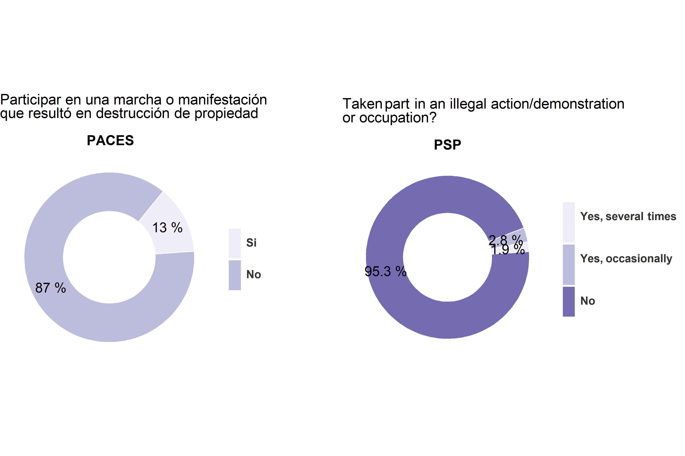


#### Socialización politica y discución ciudadana


__Environmental issues__

```{r}
# paces
data_paces_sat=data_paces %>% select(P37C) %>% as.data.frame
data_paces_sat <- na.omit(data_paces_sat)
data_paces_sat$P37C <- factor(data_paces_sat$P37C, levels = c(1,2,3,4), labels = c("
  <br>
  <strong>
  Nunca</strong></b>
  <br>", "
  <br> 
  <strong>
  Casi nunca</strong></b>
  <br>", "
  <br>
  <strong>
  A veces </strong></b>
  <br>", "
  <br>
  <strong>
  Siempre </strong></b>
  <br>"))
sat <- data_paces_sat %>%
  group_by("Alternativas"=P37C) %>%
  summarise(counts = n())
f_sat<-freq(data_paces_sat$P37C)
sat$prop<-f_sat[1:4,2]
sat <- sat %>%
  arrange(desc(Alternativas)) %>%
  mutate(
         lab.ypos = cumsum(prop) - 0.5*prop)
plot_sat <- ggplot(sat, aes(x = 2, y = prop, fill = Alternativas)) +
  geom_bar(stat = "identity", color = "white") +
  coord_polar(theta = "y", start = 1.5)+
  geom_text(aes(label = format(paste(round(prop,1),"%")), y = lab.ypos), color = "black", size=6) +
  scale_fill_brewer(palette = "Purples") +
  theme_void()+
  xlim(0.5, 2.5) +
  theme(legend.title = element_text(size=16, face="bold")) +
  theme(legend.text = element_markdown(colour = "grey20", size =14)) +
  ggtitle("<span style='font-size:28px'>How often does it happen that you and your friends talk about the following things? <br> <span style='color:#FFFFFF'>aaaaaaaaaaaaaaaaaaaaaaa</span> <strong> Environmental issues </span> <br>",subtitle = "<strong><span style='font-size:23px'>PACES</span></strong>") +    theme(plot.title = element_markdown(hjust=-0.1),
       #legend.direction = "horizontal",
       #legend.position = "bottom",
#       legend.position=c(1,0),
#              legend.position = c(.95, .95),
    legend.justification = c("left"),#, "top"),
    legend.box.just = "left",
    legend.margin = margin(6, 6, 6, 6),
    plot.subtitle = element_markdown(hjust = 0.5),
       legend.title = element_blank())


#######################################################
# psp
#######################################################

#PRE6

data_psp_sat=data_psp %>% select(kt5) %>% as.data.frame
data_psp_sat <- na.omit(data_psp_sat)
data_psp_sat$kt5 <- factor(data_psp_sat$kt5, levels = c(4,3,2,1), labels = c("
  <br>
  <strong>
  Never </strong></b>
  <br>", "
  <br> 
  <strong>
  Seldom </strong></b>
  <br>", "
  <br>
  <strong>
  Now and then </strong></b>
  <br>",  "
  <br>
  <strong>
  Very often </strong></b>
  <br>"))
  sat <- data_psp_sat %>%
  group_by("Alternativas"=kt5) %>%
  summarise(counts = n())
f_sat<-freq(data_psp_sat$kt5)
sat$prop<-f_sat[1:4,2]
sat <- sat %>%
  arrange(desc(Alternativas)) %>%
  mutate(
         lab.ypos = cumsum(prop) - 0.5*prop)
plot_sat_psp <- ggplot(sat, aes(x = 2, y = prop, fill = Alternativas)) +
  geom_bar(stat = "identity", color = "white") +
  coord_polar(theta = "y", start = 1.5)+
  geom_text(aes(label = format(paste(round(prop,1),"%")), y = lab.ypos), color = "black", size=6) +
  scale_fill_brewer(palette = "Purples") +#, 
                    #guide = guide_legend(reverse = TRUE)) +#,
                    #direction=-1) +
  theme_void()+
  xlim(0.5, 2.5) +
  theme(legend.title = element_text(size=16, face="bold")) +
  theme(legend.text = element_markdown(colour = "grey20", size =14)) +
  ggtitle(" ",subtitle="<br><br><strong><span style='font-size:23px'>PSP</span></strong>") +  
  theme(plot.title = element_markdown(hjust=0.0),
       #legend.direction = "horizontal",
       #legend.position = "bottom",
#       legend.position=c(1,0),
#              legend.position = c(.95, .95),
    legend.justification = c("left"),#, "top"),
    legend.box.just = "left",
    legend.margin = margin(6, 6, 6, 6),
    plot.subtitle = element_markdown(hjust = 0.5),
       legend.title = element_blank())

# Gráfico conjunto
plotcha1<- cowplot::plot_grid(plot_sat,plot_sat_psp, ncol=2)
ggsave(plotcha1, file = "output/plotdiscper1.png",device = "png",width = 30,height = 20,dpi = "retina",units = "cm")

```
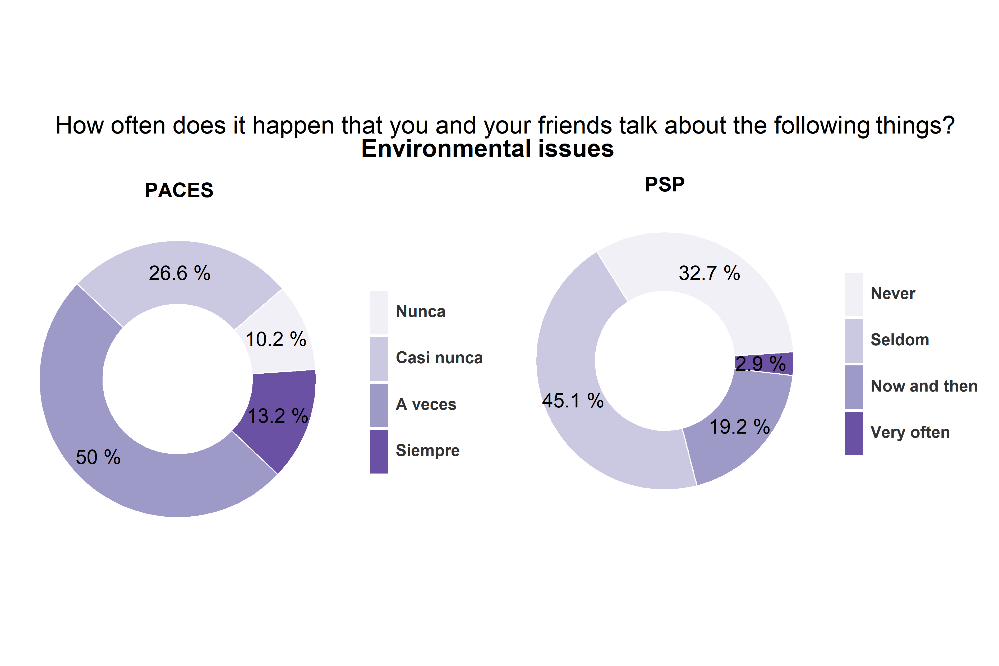

__Facebook and contacts with others on the Internet__

```{r}
# paces
data_paces_sat=data_paces %>% select(P37D) %>% as.data.frame
data_paces_sat <- na.omit(data_paces_sat)
data_paces_sat$P37D <- factor(data_paces_sat$P37D, levels = c(1,2,3,4), labels = c("
  <br>
  <strong>
  Nunca</strong></b>
  <br>", "
  <br> 
  <strong>
  Casi nunca</strong></b>
  <br>", "
  <br>
  <strong>
  A veces </strong></b>
  <br>", "
  <br>
  <strong>
  Siempre </strong></b>
  <br>"))
sat <- data_paces_sat %>%
  group_by("Alternativas"=P37D) %>%
  summarise(counts = n())
f_sat<-freq(data_paces_sat$P37D)
sat$prop<-f_sat[1:4,2]
sat <- sat %>%
  arrange(desc(Alternativas)) %>%
  mutate(
         lab.ypos = cumsum(prop) - 0.5*prop)
plot_sat <- ggplot(sat, aes(x = 2, y = prop, fill = Alternativas)) +
  geom_bar(stat = "identity", color = "white") +
  coord_polar(theta = "y", start = 1.5)+
  geom_text(aes(label = format(paste(round(prop,1),"%")), y = lab.ypos), color = "black", size=6) +
  scale_fill_brewer(palette = "Purples") +
  theme_void()+
  xlim(0.5, 2.5) +
  theme(legend.title = element_text(size=16, face="bold")) +
  theme(legend.text = element_markdown(colour = "grey20", size =14)) +
  ggtitle("<span style='font-size:28px'>How often does it happen that you and your friends talk about the following things? <br> <span style='color:#FFFFFF'>aaaaaaa</span> <strong> Facebook and contacts with others on the Internet </span> <br>",subtitle = "<strong><span style='font-size:23px'>PACES</span></strong>") +    theme(plot.title = element_markdown(hjust=-0.1),
       #legend.direction = "horizontal",
       #legend.position = "bottom",
#       legend.position=c(1,0),
#              legend.position = c(.95, .95),
    legend.justification = c("left"),#, "top"),
    legend.box.just = "left",
    legend.margin = margin(6, 6, 6, 6),
    plot.subtitle = element_markdown(hjust = 0.5),
       legend.title = element_blank())


#######################################################
# psp
#######################################################

#PRE6

data_psp_sat=data_psp %>% select(kt6) %>% as.data.frame
data_psp_sat <- na.omit(data_psp_sat)
data_psp_sat$kt6 <- factor(data_psp_sat$kt6, levels = c(4,3,2,1), labels = c("
  <br>
  <strong>
  Never </strong></b>
  <br>", "
  <br> 
  <strong>
  Seldom </strong></b>
  <br>", "
  <br>
  <strong>
  Now and then </strong></b>
  <br>",  "
  <br>
  <strong>
  Very often </strong></b>
  <br>"))
  sat <- data_psp_sat %>%
  group_by("Alternativas"=kt6) %>%
  summarise(counts = n())
f_sat<-freq(data_psp_sat$kt6)
sat$prop<-f_sat[1:4,2]
sat <- sat %>%
  arrange(desc(Alternativas)) %>%
  mutate(
         lab.ypos = cumsum(prop) - 0.5*prop)
plot_sat_psp <- ggplot(sat, aes(x = 2, y = prop, fill = Alternativas)) +
  geom_bar(stat = "identity", color = "white") +
  coord_polar(theta = "y", start = 1.5)+
  geom_text(aes(label = format(paste(round(prop,1),"%")), y = lab.ypos), color = "black", size=6) +
  scale_fill_brewer(palette = "Purples") +#, 
                    #guide = guide_legend(reverse = TRUE)) +#,
                    #direction=-1) +
  theme_void()+
  xlim(0.5, 2.5) +
  theme(legend.title = element_text(size=16, face="bold")) +
  theme(legend.text = element_markdown(colour = "grey20", size =14)) +
  ggtitle(" ",subtitle="<br><br><strong><span style='font-size:23px'>PSP</span></strong>") +  
  theme(plot.title = element_markdown(hjust=0.0),
       #legend.direction = "horizontal",
       #legend.position = "bottom",
#       legend.position=c(1,0),
#              legend.position = c(.95, .95),
    legend.justification = c("left"),#, "top"),
    legend.box.just = "left",
    legend.margin = margin(6, 6, 6, 6),
    plot.subtitle = element_markdown(hjust = 0.5),
       legend.title = element_blank())

# Gráfico conjunto
plotcha1<- cowplot::plot_grid(plot_sat,plot_sat_psp, ncol=2)
ggsave(plotcha1, file = "output/plotdiscper2.png",device = "png",width = 30,height = 20,dpi = "retina",units = "cm")

```
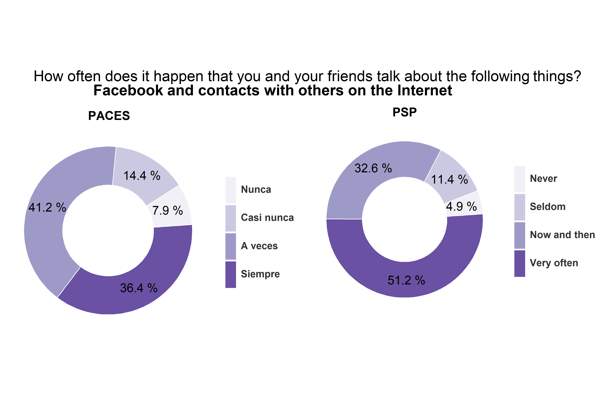


__Politics or societal issues__


```{r}
# paces
data_paces_sat=data_paces %>% select(P37E) %>% as.data.frame
data_paces_sat <- na.omit(data_paces_sat)
data_paces_sat$P37E <- factor(data_paces_sat$P37E, levels = c(1,2,3,4), labels = c("
  <br>
  <strong>
  Nunca</strong></b>
  <br>", "
  <br> 
  <strong>
  Casi nunca</strong></b>
  <br>", "
  <br>
  <strong>
  A veces </strong></b>
  <br>", "
  <br>
  <strong>
  Siempre </strong></b>
  <br>"))
sat <- data_paces_sat %>%
  group_by("Alternativas"=P37E) %>%
  summarise(counts = n())
f_sat<-freq(data_paces_sat$P37E)
sat$prop<-f_sat[1:4,2]
sat <- sat %>%
  arrange(desc(Alternativas)) %>%
  mutate(
         lab.ypos = cumsum(prop) - 0.5*prop)
plot_sat <- ggplot(sat, aes(x = 2, y = prop, fill = Alternativas)) +
  geom_bar(stat = "identity", color = "white") +
  coord_polar(theta = "y", start = 1.5)+
  geom_text(aes(label = format(paste(round(prop,1),"%")), y = lab.ypos), color = "black", size=6) +
  scale_fill_brewer(palette = "Purples") +
  theme_void()+
  xlim(0.5, 2.5) +
  theme(legend.title = element_text(size=16, face="bold")) +
  theme(legend.text = element_markdown(colour = "grey20", size =14)) +
  ggtitle("<span style='font-size:28px'>How often does it happen that you and your friends talk about the following things? <br> <span style='color:#FFFFFF'>aaaaaaaaaaaaaaaaaa</span> <strong> Politics or societal issues </span> <br>",subtitle = "<strong><span style='font-size:23px'>PACES</span></strong>") +    theme(plot.title = element_markdown(hjust=-0.1),
       #legend.direction = "horizontal",
       #legend.position = "bottom",
#       legend.position=c(1,0),
#              legend.position = c(.95, .95),
    legend.justification = c("left"),#, "top"),
    legend.box.just = "left",
    legend.margin = margin(6, 6, 6, 6),
    plot.subtitle = element_markdown(hjust = 0.5),
       legend.title = element_blank())


#######################################################
# psp
#######################################################

#PRE6

data_psp_sat=data_psp %>% select(kt8) %>% as.data.frame
data_psp_sat <- na.omit(data_psp_sat)
data_psp_sat$kt8 <- factor(data_psp_sat$kt8, levels = c(4,3,2,1), labels = c("
  <br>
  <strong>
  Never </strong></b>
  <br>", "
  <br> 
  <strong>
  Seldom </strong></b>
  <br>", "
  <br>
  <strong>
  Now and then </strong></b>
  <br>",  "
  <br>
  <strong>
  Very often </strong></b>
  <br>"))
  sat <- data_psp_sat %>%
  group_by("Alternativas"=kt8) %>%
  summarise(counts = n())
f_sat<-freq(data_psp_sat$kt8)
sat$prop<-f_sat[1:4,2]
sat <- sat %>%
  arrange(desc(Alternativas)) %>%
  mutate(
         lab.ypos = cumsum(prop) - 0.5*prop)
plot_sat_psp <- ggplot(sat, aes(x = 2, y = prop, fill = Alternativas)) +
  geom_bar(stat = "identity", color = "white") +
  coord_polar(theta = "y", start = 1.5)+
  geom_text(aes(label = format(paste(round(prop,1),"%")), y = lab.ypos), color = "black", size=6) +
  scale_fill_brewer(palette = "Purples") +#, 
                    #guide = guide_legend(reverse = TRUE)) +#,
                    #direction=-1) +
  theme_void()+
  xlim(0.5, 2.5) +
  theme(legend.title = element_text(size=16, face="bold")) +
  theme(legend.text = element_markdown(colour = "grey20", size =14)) +
  ggtitle(" ",subtitle="<br><br><strong><span style='font-size:23px'>PSP</span></strong>") +  
  theme(plot.title = element_markdown(hjust=0.0),
       #legend.direction = "horizontal",
       #legend.position = "bottom",
#       legend.position=c(1,0),
#              legend.position = c(.95, .95),
    legend.justification = c("left"),#, "top"),
    legend.box.just = "left",
    legend.margin = margin(6, 6, 6, 6),
    plot.subtitle = element_markdown(hjust = 0.5),
       legend.title = element_blank())

# Gráfico conjunto
plotcha1<- cowplot::plot_grid(plot_sat,plot_sat_psp, ncol=2)
ggsave(plotcha1, file = "output/plotdiscper3.png",device = "png",width = 30,height = 20,dpi = "retina",units = "cm")

```
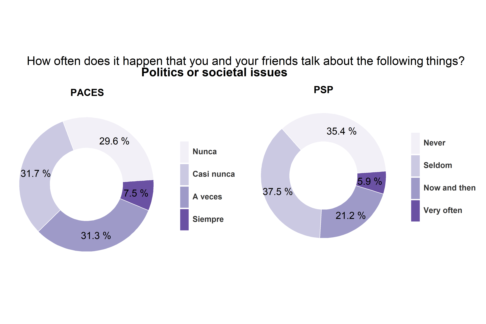

__What you have heard on the news about what is going on in ´country´ and around the world__


```{r}
# paces
data_paces_sat=data_paces %>% select(P38A) %>% as.data.frame
data_paces_sat <- na.omit(data_paces_sat)
data_paces_sat$P38A <- factor(data_paces_sat$P38A, levels = c(1,2,3,4), labels = c("
  <br>
  <strong>
  Nunca</strong></b>
  <br>", "
  <br> 
  <strong>
  Casi nunca</strong></b>
  <br>", "
  <br>
  <strong>
  A veces </strong></b>
  <br>", "
  <br>
  <strong>
  Siempre </strong></b>
  <br>"))
sat <- data_paces_sat %>%
  group_by("Alternativas"=P38A) %>%
  summarise(counts = n())
f_sat<-freq(data_paces_sat$P38A)
sat$prop<-f_sat[1:4,2]
sat <- sat %>%
  arrange(desc(Alternativas)) %>%
  mutate(
         lab.ypos = cumsum(prop) - 0.5*prop)
plot_sat <- ggplot(sat, aes(x = 2, y = prop, fill = Alternativas)) +
  geom_bar(stat = "identity", color = "white") +
  coord_polar(theta = "y", start = 1.5)+
  geom_text(aes(label = format(paste(round(prop,1),"%")), y = lab.ypos), color = "black", size=6) +
  scale_fill_brewer(palette = "Purples") +
  theme_void()+
  xlim(0.5, 2.5) +
  theme(legend.title = element_text(size=16, face="bold")) +
  theme(legend.text = element_markdown(colour = "grey20", size =14)) +
  ggtitle("<span style='font-size:28px'>How often does it happen that you and your parents talk about the following things? <br> <strong> <span style='color:#FFFFFF'>aaaaaa</span>What you have heard on the news about what is going <br> <span style='color:#FFFFFF'>aaaaaaaaaaaaa</span> on in ´country´ and around the world </span> <br>",subtitle = "<strong><span style='font-size:23px'>PACES</span></strong>") +    theme(plot.title = element_markdown(hjust=-0.1),
       #legend.direction = "horizontal",
       #legend.position = "bottom",
#       legend.position=c(1,0),
#              legend.position = c(.95, .95),
    legend.justification = c("left"),#, "top"),
    legend.box.just = "left",
    legend.margin = margin(6, 6, 6, 6),
    plot.subtitle = element_markdown(hjust = 0.5),
       legend.title = element_blank())


#######################################################
# psp
#######################################################

#PRE6

data_psp_sat=data_psp %>% select(ft3) %>% as.data.frame
data_psp_sat <- na.omit(data_psp_sat)
data_psp_sat$ft3 <- factor(data_psp_sat$ft3, levels = c(4,3,2,1), labels = c("
  <br>
  <strong>
  Never </strong></b>
  <br>", "
  <br> 
  <strong>
  Seldom </strong></b>
  <br>", "
  <br>
  <strong>
  Now and then </strong></b>
  <br>",  "
  <br>
  <strong>
  Very often </strong></b>
  <br>"))
  sat <- data_psp_sat %>%
  group_by("Alternativas"=ft3) %>%
  summarise(counts = n())
f_sat<-freq(data_psp_sat$ft3)
sat$prop<-f_sat[1:4,2]
sat <- sat %>%
  arrange(desc(Alternativas)) %>%
  mutate(
         lab.ypos = cumsum(prop) - 0.5*prop)
plot_sat_psp <- ggplot(sat, aes(x = 2, y = prop, fill = Alternativas)) +
  geom_bar(stat = "identity", color = "white") +
  coord_polar(theta = "y", start = 1.5)+
  geom_text(aes(label = format(paste(round(prop,1),"%")), y = lab.ypos), color = "black", size=6) +
  scale_fill_brewer(palette = "Purples") +#, 
                    #guide = guide_legend(reverse = TRUE)) +#,
                    #direction=-1) +
  theme_void()+
  xlim(0.5, 2.5) +
  theme(legend.title = element_text(size=16, face="bold")) +
  theme(legend.text = element_markdown(colour = "grey20", size =14)) +
  ggtitle(" ",subtitle="<br><br><strong><span style='font-size:23px'>PSP</span></strong>") +  
  theme(plot.title = element_markdown(hjust=0.0),
       #legend.direction = "horizontal",
       #legend.position = "bottom",
#       legend.position=c(1,0),
#              legend.position = c(.95, .95),
    legend.justification = c("left"),#, "top"),
    legend.box.just = "left",
    legend.margin = margin(6, 6, 6, 6),
    plot.subtitle = element_markdown(hjust = 0.5),
       legend.title = element_blank())

# Gráfico conjunto
plotcha1<- cowplot::plot_grid(plot_sat,plot_sat_psp, ncol=2)
ggsave(plotcha1, file = "output/plotdiscpar1.png",device = "png",width = 30,height = 20,dpi = "retina",units = "cm")

```
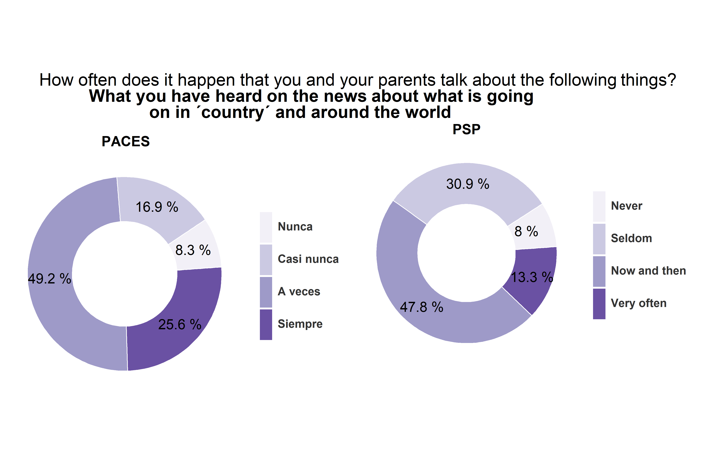


__Environmental issues__


```{r}
# paces
data_paces_sat=data_paces %>% select(P38C) %>% as.data.frame
data_paces_sat <- na.omit(data_paces_sat)
data_paces_sat$P38C <- factor(data_paces_sat$P38C, levels = c(1,2,3,4), labels = c("
  <br>
  <strong>
  Nunca</strong></b>
  <br>", "
  <br> 
  <strong>
  Casi nunca</strong></b>
  <br>", "
  <br>
  <strong>
  A veces </strong></b>
  <br>", "
  <br>
  <strong>
  Siempre </strong></b>
  <br>"))
sat <- data_paces_sat %>%
  group_by("Alternativas"=P38C) %>%
  summarise(counts = n())
f_sat<-freq(data_paces_sat$P38C)
sat$prop<-f_sat[1:4,2]
sat <- sat %>%
  arrange(desc(Alternativas)) %>%
  mutate(
         lab.ypos = cumsum(prop) - 0.5*prop)
plot_sat <- ggplot(sat, aes(x = 2, y = prop, fill = Alternativas)) +
  geom_bar(stat = "identity", color = "white") +
  coord_polar(theta = "y", start = 1.5)+
  geom_text(aes(label = format(paste(round(prop,1),"%")), y = lab.ypos), color = "black", size=6) +
  scale_fill_brewer(palette = "Purples") +
  theme_void()+
  xlim(0.5, 2.5) +
  theme(legend.title = element_text(size=16, face="bold")) +
  theme(legend.text = element_markdown(colour = "grey20", size =14)) +
  ggtitle("<span style='font-size:28px'>How often does it happen that you and your parents talk about the following things? <br> <span style='color:#FFFFFF'>aaaaaaaaaaaaaaaaaaaaaaa</span> <strong> Environmental issues </span> <br>",subtitle = "<strong><span style='font-size:23px'>PACES</span></strong>") +    theme(plot.title = element_markdown(hjust=-0.1),
       #legend.direction = "horizontal",
       #legend.position = "bottom",
#       legend.position=c(1,0),
#              legend.position = c(.95, .95),
    legend.justification = c("left"),#, "top"),
    legend.box.just = "left",
    legend.margin = margin(6, 6, 6, 6),
    plot.subtitle = element_markdown(hjust = 0.5),
       legend.title = element_blank())


#######################################################
# psp
#######################################################

#PRE6

data_psp_sat=data_psp %>% select(ft5) %>% as.data.frame
data_psp_sat <- na.omit(data_psp_sat)
data_psp_sat$ft5 <- factor(data_psp_sat$ft5, levels = c(4,3,2,1), labels = c("
  <br>
  <strong>
  Never </strong></b>
  <br>", "
  <br> 
  <strong>
  Seldom </strong></b>
  <br>", "
  <br>
  <strong>
  Now and then </strong></b>
  <br>",  "
  <br>
  <strong>
  Very often </strong></b>
  <br>"))
  sat <- data_psp_sat %>%
  group_by("Alternativas"=ft5) %>%
  summarise(counts = n())
f_sat<-freq(data_psp_sat$ft5)
sat$prop<-f_sat[1:4,2]
sat <- sat %>%
  arrange(desc(Alternativas)) %>%
  mutate(
         lab.ypos = cumsum(prop) - 0.5*prop)
plot_sat_psp <- ggplot(sat, aes(x = 2, y = prop, fill = Alternativas)) +
  geom_bar(stat = "identity", color = "white") +
  coord_polar(theta = "y", start = 1.5)+
  geom_text(aes(label = format(paste(round(prop,1),"%")), y = lab.ypos), color = "black", size=6) +
  scale_fill_brewer(palette = "Purples") +#, 
                    #guide = guide_legend(reverse = TRUE)) +#,
                    #direction=-1) +
  theme_void()+
  xlim(0.5, 2.5) +
  theme(legend.title = element_text(size=16, face="bold")) +
  theme(legend.text = element_markdown(colour = "grey20", size =14)) +
  ggtitle(" ",subtitle="<br><br><strong><span style='font-size:23px'>PSP</span></strong>") +  
  theme(plot.title = element_markdown(hjust=0.0),
       #legend.direction = "horizontal",
       #legend.position = "bottom",
#       legend.position=c(1,0),
#              legend.position = c(.95, .95),
    legend.justification = c("left"),#, "top"),
    legend.box.just = "left",
    legend.margin = margin(6, 6, 6, 6),
    plot.subtitle = element_markdown(hjust = 0.5),
       legend.title = element_blank())

# Gráfico conjunto
plotcha1<- cowplot::plot_grid(plot_sat,plot_sat_psp, ncol=2)
ggsave(plotcha1, file = "output/plotdiscpar2.png",device = "png",width = 30,height = 20,dpi = "retina",units = "cm")

```
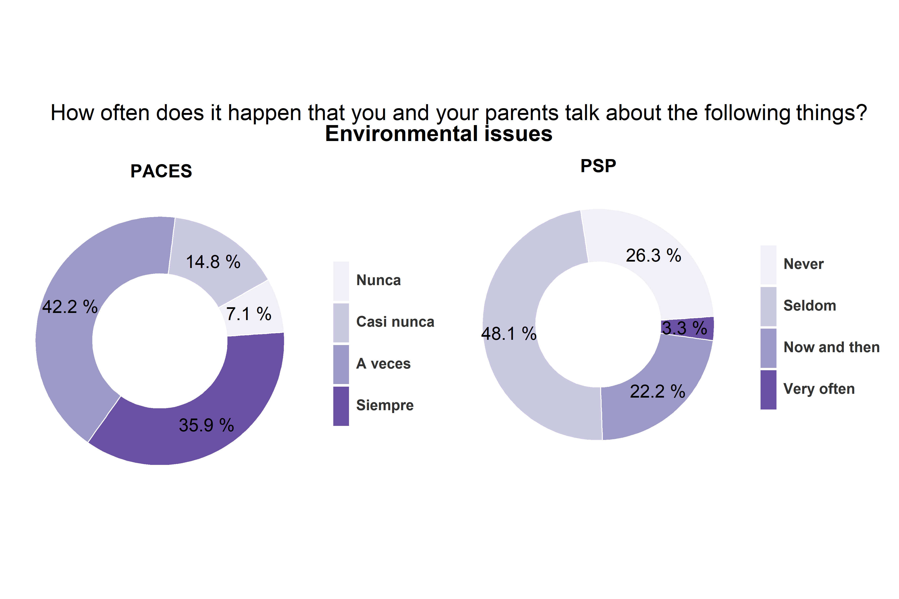

__Politics or societal issues__


```{r}
# paces
data_paces_sat=data_paces %>% select(P38E) %>% as.data.frame
data_paces_sat <- na.omit(data_paces_sat)
data_paces_sat$P38E <- factor(data_paces_sat$P38E, levels = c(1,2,3,4), labels = c("
  <br>
  <strong>
  Nunca</strong></b>
  <br>", "
  <br> 
  <strong>
  Casi nunca</strong></b>
  <br>", "
  <br>
  <strong>
  A veces </strong></b>
  <br>", "
  <br>
  <strong>
  Siempre </strong></b>
  <br>"))
sat <- data_paces_sat %>%
  group_by("Alternativas"=P38E) %>%
  summarise(counts = n())
f_sat<-freq(data_paces_sat$P38E)
sat$prop<-f_sat[1:4,2]
sat <- sat %>%
  arrange(desc(Alternativas)) %>%
  mutate(
         lab.ypos = cumsum(prop) - 0.5*prop)
plot_sat <- ggplot(sat, aes(x = 2, y = prop, fill = Alternativas)) +
  geom_bar(stat = "identity", color = "white") +
  coord_polar(theta = "y", start = 1.5)+
  geom_text(aes(label = format(paste(round(prop,1),"%")), y = lab.ypos), color = "black", size=6) +
  scale_fill_brewer(palette = "Purples") +
  theme_void()+
  xlim(0.5, 2.5) +
  theme(legend.title = element_text(size=16, face="bold")) +
  theme(legend.text = element_markdown(colour = "grey20", size =14)) +
  ggtitle("<span style='font-size:28px'>How often does it happen that you and your parents talk about the following things? <br> <span style='color:#FFFFFF'>aaaaaaaaaaaaaaaaaaaaaaa</span> <strong> Politics or societal issues </span> <br>",subtitle = "<strong><span style='font-size:23px'>PACES</span></strong>") +    theme(plot.title = element_markdown(hjust=-0.1),
       #legend.direction = "horizontal",
       #legend.position = "bottom",
#       legend.position=c(1,0),
#              legend.position = c(.95, .95),
    legend.justification = c("left"),#, "top"),
    legend.box.just = "left",
    legend.margin = margin(6, 6, 6, 6),
    plot.subtitle = element_markdown(hjust = 0.5),
       legend.title = element_blank())


#######################################################
# psp
#######################################################

#PRE6

data_psp_sat=data_psp %>% select(ft8) %>% as.data.frame
data_psp_sat <- na.omit(data_psp_sat)
data_psp_sat$ft8 <- factor(data_psp_sat$ft8, levels = c(4,3,2,1), labels = c("
  <br>
  <strong>
  Never </strong></b>
  <br>", "
  <br> 
  <strong>
  Seldom </strong></b>
  <br>", "
  <br>
  <strong>
  Now and then </strong></b>
  <br>",  "
  <br>
  <strong>
  Very often </strong></b>
  <br>"))
  sat <- data_psp_sat %>%
  group_by("Alternativas"=ft8) %>%
  summarise(counts = n())
f_sat<-freq(data_psp_sat$ft8)
sat$prop<-f_sat[1:4,2]
sat <- sat %>%
  arrange(desc(Alternativas)) %>%
  mutate(
         lab.ypos = cumsum(prop) - 0.5*prop)
plot_sat_psp <- ggplot(sat, aes(x = 2, y = prop, fill = Alternativas)) +
  geom_bar(stat = "identity", color = "white") +
  coord_polar(theta = "y", start = 1.5)+
  geom_text(aes(label = format(paste(round(prop,1),"%")), y = lab.ypos), color = "black", size=6) +
  scale_fill_brewer(palette = "Purples") +#, 
                    #guide = guide_legend(reverse = TRUE)) +#,
                    #direction=-1) +
  theme_void()+
  xlim(0.5, 2.5) +
  theme(legend.title = element_text(size=16, face="bold")) +
  theme(legend.text = element_markdown(colour = "grey20", size =14)) +
  ggtitle(" ",subtitle="<br><br><strong><span style='font-size:23px'>PSP</span></strong>") +  
  theme(plot.title = element_markdown(hjust=0.0),
       #legend.direction = "horizontal",
       #legend.position = "bottom",
#       legend.position=c(1,0),
#              legend.position = c(.95, .95),
    legend.justification = c("left"),#, "top"),
    legend.box.just = "left",
    legend.margin = margin(6, 6, 6, 6),
    plot.subtitle = element_markdown(hjust = 0.5),
       legend.title = element_blank())

# Gráfico conjunto
plotcha1<- cowplot::plot_grid(plot_sat,plot_sat_psp, ncol=2)
ggsave(plotcha1, file = "output/plotdiscpar3.png",device = "png",width = 30,height = 20,dpi = "retina",units = "cm")

```
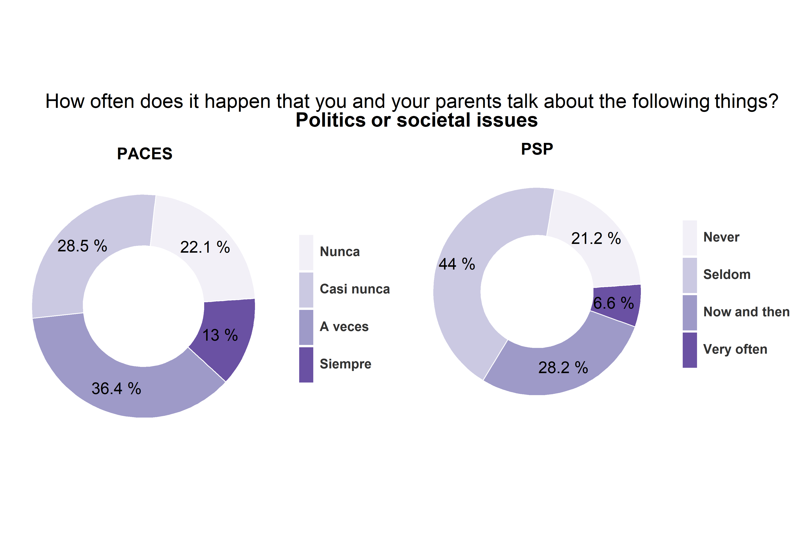


>  ICCS

```{r, include=TRUE}
  iccs_chsw %>% na.omit() %>% group_by(COUNTRY,IS3G14A) %>% summarise(n=n()) %>%  mutate(freq = round(n / sum(n), 3)) %>% ggplot(aes(x=freq, y=as.character(IS3G14A), fill=COUNTRY)) + geom_bar(stat = "identity",position=position_dodge()) + scale_y_discrete(labels=c("Casi nunca",  "Mensual","Semanal" ,"Casi diario")) +ggtitle("Con qué frecuencia hablas con tus padres sobre temas políticos o sociales")
```

```{r,include=TRUE}
  iccs_chsw %>% na.omit() %>% group_by(COUNTRY,IS3G14A) %>% summarise(n=n()) %>%  mutate(freq = round(n / sum(n), 3)) %>% ggplot(aes(x=freq, y=as.character(IS3G14A), fill=COUNTRY)) + geom_bar(stat = "identity",position=position_dodge()) + scale_y_discrete(labels=c("Casi nunca",  "Mensual","Semanal" ,"Casi diario")) +ggtitle("Con qué frecuencia hablas con tus amigos sobre temas políticos o sociales")
```


```{r, include=TRUE}
  iccs_chsw %>% na.omit() %>% group_by(COUNTRY,IS3G14B) %>% summarise(n=n()) %>%  mutate(freq = round(n / sum(n), 3)) %>% ggplot(aes(x=freq, y=as.character(IS3G14B), fill=COUNTRY)) + geom_bar(stat = "identity",position=position_dodge()) + scale_y_discrete(labels=c("Casi nunca",  "Mensual","Semanal" ,"Casi diario")) +ggtitle("Con qué frecuencia ves televisión para informarte sobre noticias nacionales e internacionales")
```

